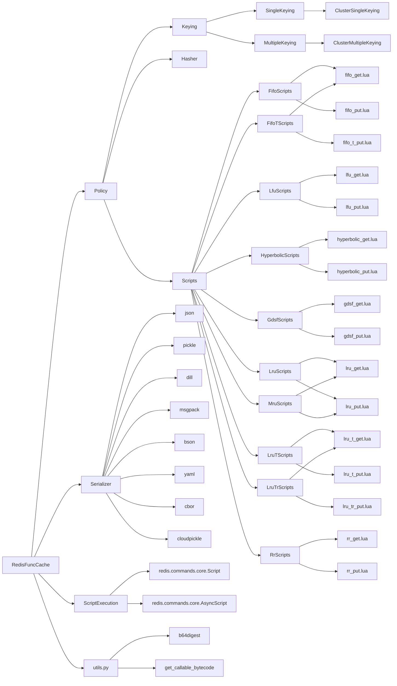
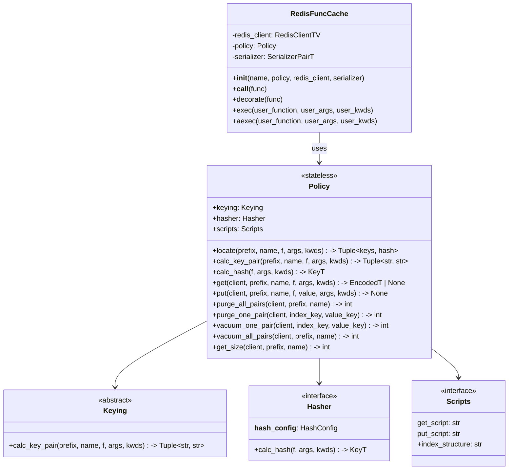
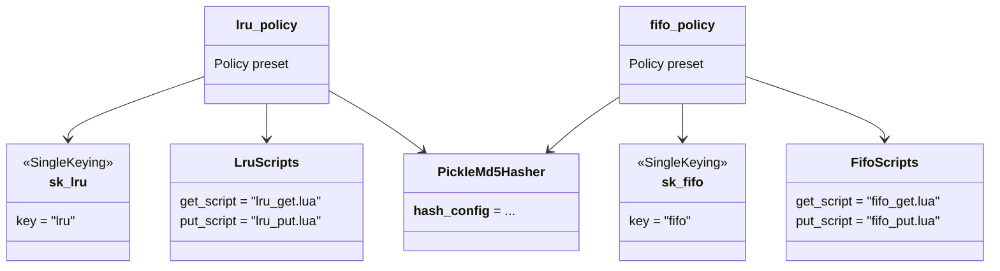
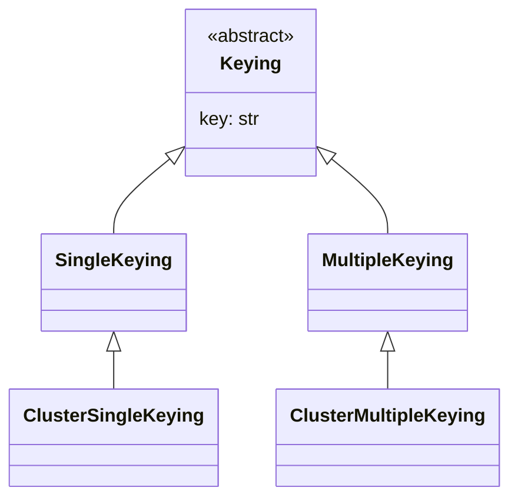
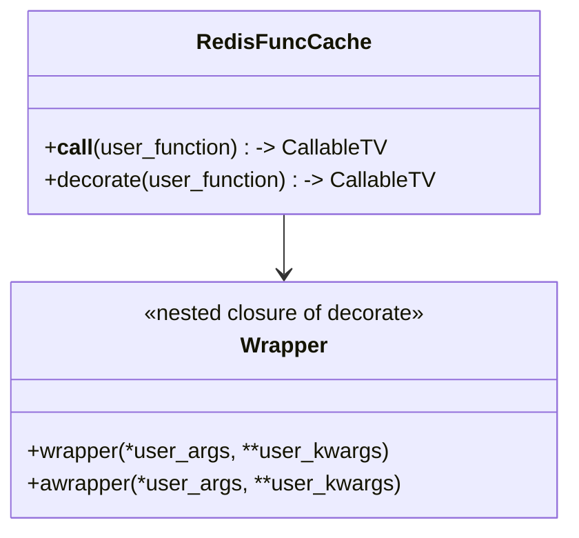

# Contributing

Thank you for your interest in contributing to redis_func_cache! This document provides guidelines and information to help you contribute effectively to the project.

## Code of Conduct

By participating in this project, you are expected to uphold our Code of Conduct, which promotes a welcoming and inclusive environment for all contributors.

## How to Contribute

### Reporting Bugs

Before reporting a bug, please check the existing issues to see if it has been reported. If not, create a new issue with:

- A clear and descriptive title
- A detailed description of the problem
- Steps to reproduce the issue
- Expected vs. actual behavior
- Your environment information (Python version, Redis version, OS, etc.)

### Suggesting Enhancements

We welcome feature requests and suggestions. To propose an enhancement:

1. Check existing issues to avoid duplicates
2. Create a new issue with a clear title and detailed description
3. Explain why this enhancement would be useful
4. If possible, provide examples of how the feature would be used

### Code Contributions

#### Development Setup

1. Fork the repository

2. Clone your fork:

   ```bash
   git clone https://github.com/your-username/redis_func_cache.git
   cd redis_func_cache
   ```

3. initialize the development environment

   ```bash
   python -m venv .venv
   source .venv/bin/activate
   pip install -e .[all] --group dev
   ```

   Or if you are using [uv][]:

   ```bash
   uv sync --all-extras --dev
   ```

   A virtual environment is created at directory `.venv`. You can activate it by running `source .venv/bin/activate` or `.venv/Scripts/activate` on Windows.

   The minimum required Python version is 3.10.

   Install the [pre-commit][] hooks:

   ```bash
   pre-commit install
   ```

#### Running Tests

Ensure all tests pass before submitting changes:

1. Start a Redis server.
2. Set the `REDIS_URL` environment variable (defaults to `redis://` if not defined) to point to it.
3. Run the tests:

   ```bash
   uv run pytest -xv --cov
   ```

If the changes are concerned with Redis cluster, enable the cluster test groups by setting the environment variable

- `REDIS_CLUSTER_NODES`: `":"`-separated list of Redis cluster nodes

A `.env` file can be used to set the environment variables.

A Docker Compose file for unit testing is provided in the `docker` directory to simplify the process. You can run it by executing:

```bash
cd docker
docker compose run --rm unittest
```

It starts the Redis standalone server and cluster automatically (waits until healthy), runs lint, static checks and pytest against Python 3.10–3.14, and propagates the exit code.

The test container uses `uv run --frozen`, which installs dependencies strictly from `uv.lock` and never updates it. Note that `uv.lock` is **not** tracked in SCM (`*.lock` is gitignored), so:

- On a fresh checkout without `uv.lock`, the test script generates it once automatically before running.
- If you change dependencies in `pyproject.toml`, regenerate the lock yourself, otherwise the container keeps testing against the outdated resolution:

  ```bash
  uv lock
  ```

The container mounts named volumes for the uv download cache and the per-version virtual environments (`/venvs`), so repeated runs only do incremental installs. To force a full rebuild, remove them with `docker compose down -v`.

#### Code Style

We use several tools to maintain code quality:

- **Ruff**: For linting and formatting. Check <https://docs.astral.sh/ruff/> for more details.
- **MyPy**: For static type checking. Check <https://mypy.readthedocs.io/en/stable/> for more details.
- **Pre-commit hooks**: To automatically check code before committing. Check <https://pre-commit.com/> for more details.

Some hooks are `language: system` and invoke external tools, so besides the Python toolchain above you also need:

- **[uv][]**: runs the `mypy` hook inside the project environment, so the type checker sees exactly the locked dependencies (no shadow `additional_dependencies` to keep in sync).
- **Node.js / npx**: the `prettier` hook runs via `npx` (any recent Node LTS works; it downloads prettier on first use).
- **lua-language-server**: the `luals` hook statically checks the Lua scripts against `src/redis_func_cache/lua/.luarc.json` and the Redis type stubs in `src/redis_func_cache/lua/meta/` (both are development-only files and are excluded from the built wheel/sdist).

You should install them before making changes. The same suite runs in CI as the the `pre-commit` job of the [Python package workflow](.github/workflows/python-package.yml), so a commit that bypasses the local hooks will be caught there.

To run checks manually:

```bash
# Run all pre-commit checks
pre-commit run -a

# Run lint and format
ruff check --fix
ruff format

# Run static type checking
mypy
```

#### Making Changes

1. Create a new branch for your feature or bugfix:

   ```bash
   git checkout -b feature/your-feature-name
   ```

2. Make your changes, following the code style guidelines

3. Add tests for new functionality

4. Ensure all tests pass — see [Running Tests](#running-tests) for the Redis setup and the Docker-based runner.

5. Commit your changes with a clear, descriptive commit message

6. Push to your fork and submit a pull request

### Pull Request Guidelines

When submitting a pull request:

1. Provide a clear title and description
2. Reference any related issues
3. Ensure your code follows the project's style guidelines
4. Include tests for new functionality
5. Update documentation as needed
6. Keep pull requests focused on a single feature or bugfix

### Documentation

Improvements to documentation are always welcome. This includes:

- Updates to README.md
- Docstring improvements
- Examples and tutorials
- Comments in code

## Development Practices

### Lua Scripts

This project uses Redis Lua scripts for atomic operations. When modifying Lua scripts:

1. Ensure scripts remain atomic and efficient
2. Test with various Redis versions
3. Keep scripts readable and well-commented
4. Follow existing patterns in the codebase

### Testing

We maintain high test coverage and follow these practices:

1. Write unit tests for new functionality
2. Test both synchronous and asynchronous code paths
3. Include edge cases and error conditions
4. Test with different cache policies
5. Use appropriate mocking when needed

### Versioning

We follow [PEP 440](https://peps.python.org/pep-0440/).

## Getting Help

If you need help with your contribution:

1. Check the documentation and existing issues
2. Join our community discussions
3. Contact the maintainers directly

## Architecture

The library composes three orthogonal components into a `Policy`: **Keying** (key naming), **Hasher** (per-call sub-key computation) and **Scripts** (Lua script declarations). The module structure:



Core classes:



Composition of the three orthogonal dimensions (keying / hasher / scripts):



The four built-in keying variants:



Decorator and proxy:



## License

By contributing to redis_func_cache, you agree that your contributions will be licensed under what described in the `LICENSE.md` file.

[uv]: https://docs.astral.sh/uv/ "An extremely fast Python package and project manager, written in Rust."
[pre-commit]: https://pre-commit.com/ "A framework for managing and maintaining multi-language pre-commit hooks."
