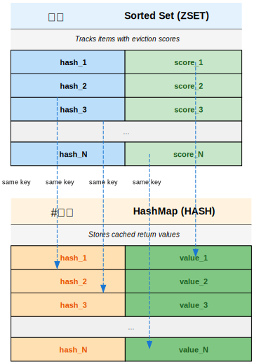
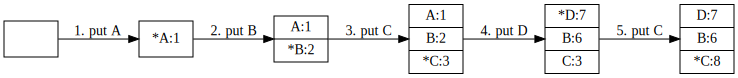
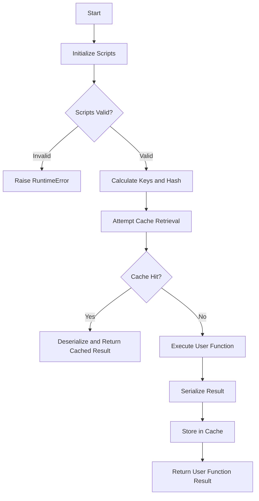
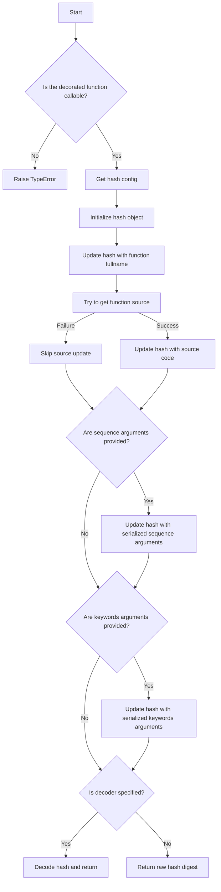

# redis_func_cache

[](https://github.com/tanbro/redis_func_cache/actions/workflows/python-package.yml)
[](https://codecov.io/gh/tanbro/redis_func_cache)
[](https://redis-func-cache.readthedocs.io/)
[](https://pypi.org/project/redis_func_cache/)

`redis_func_cache` is a Python library for caching function return values in Redis, similar to the caching functionality provided by the standard library's [`functools`](https://docs.python.org/library/functools.html) module. The `functools` module includes useful cache decorators that are handy when implementing memoization.

When we need to cache function return values across multiple processes or machines, [Redis][] can be used as a distributed backend. The purpose of this project is to provide simple and clean decorator functions to use Redis as a cache backend. It implements caches with various eviction/replacement policies such as LRU, FIFO, RR, and LFU. (Refer to [Cache Replacement Policies on Wikipedia](https://wikipedia.org/wiki/Cache_replacement_policies) for more details.)

Here is a simple example:

1. Let's first startup a redis server at 127.0.0.1:6379, eg:

   ```bash
   docker run -it --rm -p 6379:6379 redis:alpine
   ```

1. Then install the library on your python environment:

   ```bash
   pip install -U redis_func_cache
   ```

1. Finally run the following Python code:

   ```python
   from time import sleep, time

   from redis import Redis

   from redis_func_cache import LruTPolicy, RedisFuncCache

   redis_client = Redis.from_url("redis://")

   lru_cache = RedisFuncCache(__name__, LruTPolicy, redis_client)

   @lru_cache
   def a_slow_func():
       sleep(10) # Sleep to simulate a slow operation
       return "OK"

   t = time()
   r = a_slow_func()
   print(f"duration={time()-t}, {r=}")

   t = time()
   r = a_slow_func()
   print(f"duration={time()-t}, {r=}")
   ```

The output should be like:

```
duration=10.002939939498901, r='OK'
duration=0.0008025169372558594, r='OK'
```

We can see that the second call to `a_slow_func()` is served from the cache, which is much faster than the first call.

## Features

- Supports multiple cache eviction policies: LRU, FIFO, LFU, RR ...
- Asynchronous and synchronous support.
- [Redis][] cluster support.
- Simple [decorator][] syntax.
- Based on [redis-py][], the official Python client for [Redis][].

## Install

- install from PyPI:

    ```bash
    pip install -U redis_func_cache
    ```

- install from source:

    ```bash
    git clone https://github.com/tanbro/redis_func_cache.git
    cd redis_func_cache
    pip install .
    ```

- Or install from Github directly:

    ```bash
    pip install git+https://github.com/tanbro/redis_func_cache.git@main
    ```

## Data structure

The library combines a pair of [Redis][] data structures to manage cache data:

- The first one is a sorted set, which stores the hash values of the decorated function calls along with a score for each item.

    When the cache reaches its maximum size, the score is used to determine which item to evict.

- The second one is a hash map, which stores the hash values of the function calls and their corresponding return values.

This can be visualized as follows:



The main idea of eviction policy is that the cache keys are stored in a set, and the cache values are stored in a hash map. Eviction is performed by removing the lowest-scoring item from the set, and then deleting the corresponding field and value from the hash map.

Here is an example showing how the _LRU_ cache's eviction policy works(maximum size is 3):



The [`RedisFuncCache`][] executes a decorated function with specified arguments and cache its result. Here's a breakdown of the steps:

1. **Initialize Scripts**: Retrieve two Lua script objects for cache hitting and update from `policy.lua_scripts`.
1. **Calculate Keys and Hash**: Compute the cache keys using `policy.calc_keys`, compute the hash value using `policy.calc_hash`, and compute any additional arguments using `policy.calc_ext_args`.
1. **Attempt Cache Retrieval**: Attempt retrieving a cached result. If a cache hit occurs, deserialize and return the cached result.
1. **Execute User Function**: If no cache hit occurs, execute the decorated function with the provided arguments and keyword arguments.
1. **Serialize Result and Cache**: Serialize the result of the user function and store it in redis.
1. **Return Result**: Return the result of the decorated function.



## Basic Usage

### First example

Using _LRU_ cache to decorate a recursive Fibonacci function:

```python
from redis import Redis
from redis_func_cache import RedisFuncCache, LruTPolicy

redis_client = Redis(...)

lru_cache = RedisFuncCache("my-first-lru-cache", LruTPolicy, redis_client)

@lru_cache
def fib(n):
    if n <= 1:
        return n
    if n == 2:
        return 1
    return fib(n - 1) + fib(n - 2)
```

In this example, we first create a [Redis][] client, then create a [`RedisFuncCache`][] instance with the [Redis][] client and [`LruTPolicy`][] as its arguments.
Next, we use the `@lru_cache` [decorator][] to decorate the `fib` function.
This way, each computed result is cached, and subsequent calls with the same parameters retrieve the result directly from the cache, thereby improving performance.

It works almost the same as the standard library's `functools.lru_cache`, except that it uses [Redis][] as the backend instead of the local machine's memory.

If we browse the [Redis][] database, we can find the pair of keys' names look like:

- `func-cache:my-first-lru-cache:lru:__main__:fib:0`

    The key (with `0` suffix) is a sorted set that stores the hash of function invoking and their corresponding scores.

- `func-cache:my-first-lru-cache:lru:__main__:fib:1`

    The key (with `1` suffix) is a hash map. Each key field in it is the hash value of a function invoking, and the value filed is the return value of the function.

### Async functions

To decorate async functions, we shall pass a `Async Redis client` to [`RedisFuncCache`][]'s `client` argument:

```python
from redis.asyncio import Redis as AsyncRedis
from redis_func_cache import RedisFuncCache, LruTPolicy

redis_client = AsyncRedis.from_url("redis://")
my_async_cache = RedisFuncCache(__name__, LruTPolicy, redis_client)

@my_async_cache
async def my_async_func(*args, **kwargs):
    ...
```

> ❗ **Attention:**
>
> - When a [`RedisFuncCache`][] is created with an async [Redis][] client, it can only be used to decorate async functions. These async functions will be decorated with an asynchronous wrapper, and the I/O operations between the [Redis][] client and server will be performed asynchronously.
> - Conversely, a synchronous [`RedisFuncCache`][] can only decorate synchronous functions. These functions will be decorated with a synchronous wrapper, and I/O operations with [Redis][] will be performed synchronously.

### Eviction policies

If you want to use other eviction policies, you can specify another policy class as the second argument of [`RedisFuncCache`][].
For example, we use [`FifoPolicy`][] to implement a _FIFO_ cache:

```python
from redis import Redis
from redis_func_cache import RedisFuncCache, FifoPolicy

redis_client = Redis.from_url("redis://")
fifo_cache = RedisFuncCache("my-cache-2", FifoPolicy, redis_client)

@fifo_cache
def func1(x):
    ...
```

Use [`RrPolicy`][] to implement a random-remove cache:

```python
from redis import Redis
from redis_func_cache import RedisFuncCache, RrPolicy

redis_client = Redis.from_url("redis://")
rr_cache = RedisFuncCache("my-cache-3", RrPolicy, redis_client)

@rr_cache
def func2(x):
    ...
```

So far, the following cache eviction policies are available:

- **[`LruTPolicy`][]**

    > 💡 **Tip:**\
    > _LRU-T_ stands for _LRU on timestamp_. It is a pseudo-LRU policy that approximates the behavior of LRU but is not as precise. The policy removes items based on their invocation timestamps, which may not always accurately reflect the least recently used item due to potential timestamp inaccuracies.
    >
    > Despite this limitation, _LRU-T_ is **highly recommended** for common use cases. It offers better performance compared to the traditional LRU policy and provides sufficient accuracy for most applications.

- [`FifoPolicy`][]: first in first out
- [`LfuPolicy`][]: least frequently used
- [`LruPolicy`][]: least recently used
- [`MruPolicy`][]: most recently used
- [`RrPolicy`][]: random remove

> ℹ️ **Info:**\
> Explore source codes in directory `src/redis_func_cache/policies` for more details.

### Multiple [Redis][] key pairs

As described above, the cache keys are currently in a paired form, where all decorated functions share the same two keys.
However, there may be instances where we want a unique key pair for each decorated function.

One solution is to use different [`RedisFuncCache`][] instances to decorate different functions.

Another way is to use a policy that stores cache data in different [Redis][] key pairs for each function. There are several policies to do that out of the box.
For example, we can use [`LruTMultiplePolicy`][] for an _LRU_ cache that has multiple different [Redis][] key pairs to store return values of different functions, and each function has a standalone keys pair:

```python
from redis import  Redis
from redis_func_cache import RedisFuncCache, LruTMultiplePolicy

redis_client = Redis.from_url("redis://")
cache = RedisFuncCache("my-cache-4", LruTMultiplePolicy, redis_client)

@cache
def func1(x):
    ...

@cache
def func2(x):
    ...
```

In the example, [`LruTMultiplePolicy`][] inherits [`BaseMultiplePolicy`][] which implements how to store cache keys and values for each function.

When called, we can see such keys in the [Redis][] database:

- key pair for `func1`:

  - `func-cache:my-cache-4:lru_t-m:__main__:func1#<hash1>:0`
  - `func-cache:my-cache-4:lru_t-m:__main__:func1#<hash1>:1`

- key pair for `func2`:

  - `func-cache:my-cache-4:lru_t-m:__main__:func2#<hash2>:0`
  - `func-cache:my-cache-4:lru_t-m:__main__:func2#<hash2>:1`

where `<hash1>` and `<hash2>` are the hash values of the definitions of `func1` and `func2` respectively.

Policies that store cache in multiple [Redis][] key pairs are:

- [`FifoMultiplePolicy`][]
- [`LfuMultiplePolicy`][]
- [`LruMultiplePolicy`][]
- [`MruMultiplePolicy`][]
- [`RrMultiplePolicy`][]
- [`LruTMultiplePolicy`][]

### [Redis][] Cluster support

We have already known that the library implements cache algorithms based on a pair of [Redis][] data structures, the two **MUST** be in a same [Redis][] node, or it will not work correctly.

While a [Redis][] cluster will distribute keys to different nodes based on the hash value, we need to guarantee that two keys are placed on the same node. Several cluster policies are provided to achieve this. These policies use the `{...}` pattern in key names.

For example, here we use a [`LruTClusterPolicy`][] to implement a cluster-aware _LRU_ cache:

```python
from redis import Redis
from redis_func_cache import RedisFuncCache, LruTClusterPolicy

redis_client = Redis.from_url("redis://")
cache = RedisFuncCache("my-cluster-cache", LruTClusterPolicy, redis_client)

@cache
def my_func(x):
    ...
```

Thus, the names of the key pair may be like:

- `func-cache:{my-cluster-cache:lru_t-c}:0`
- `func-cache:{my-cluster-cache:lru_t-c}:1`

Notice what is in `{...}`: the [Redis][] cluster will determine which node to use by the `{...}` pattern rather than the entire key string.

Policies that support cluster are:

- [`FifoClusterPolicy`][]
- [`LfuClusterPolicy`][]
- [`LruClusterPolicy`][]
- [`MruClusterPolicy`][]
- [`RrClusterPolicy`][]
- [`LruTClusterPolicy`][]

### [Redis][] Cluster support with multiple key pairs

Policies that support both cluster and store cache in multiple [Redis][] key pairs are:

- [`FifoClusterMultiplePolicy`][]
- [`LfuClusterMultiplePolicy`][]
- [`LruClusterMultiplePolicy`][]
- [`MruClusterMultiplePolicy`][]
- [`RrClusterMultiplePolicy`][]
- [`LruTClusterMultiplePolicy`][]

### Max size and expiration time

The [`RedisFuncCache`][] instance has two arguments to control the maximum size and expiration time of the cache:

- `maxsize`: the maximum number of items that the cache can hold.

    When the cache reaches its `maxsize`, adding a new item will cause an existing cached item to be removed according to the eviction policy.

    > ℹ️ **Note:**\
    > For "multiple" policies, each decorated function has its own standalone data structure, so the value represents the maximum size of each individual data structure.

- `ttl`: The expiration time (in seconds) for the cache data structure.

    The cache's [redis][] data structure will expire and be released after the specified time.
    Each time the cache is accessed, the expiration time will be reset.

    > ℹ️ **Note:**\
    > For "multiple" policies, each decorated function has its own standalone data structure, so the `ttl` value represents the expiration time of each individual data structure. The expiration time will be reset each time the cache is accessed individually.

### Complex return types

The return value (de)serializer [JSON][] (`json` module of std-lib) by default, which does not work with complex objects.

But, still, we can use [`pickle`][] to serialize the return value, by specifying `serializers` argument of [`RedisFuncCache`][]:

```python
import pickle
from redis import Redis
from redis_func_cache import RedisFuncCache, LruTPolicy


my_pickle_cache = RedisFuncCache(
    __name__,
    LruTPolicy,
    lambda: Redis.from_url("redis://"),
    serializer=(pickle.dumps, pickle.loads)
)

# or like this:
my_pickle_cache1 = RedisFuncCache(
    __name__,
    LruTPolicy,
    lambda: Redis.from_url("redis://"),
    serializer="pickle"
)

# or just like this:
cache = RedisFuncCache(__name__, LruTPolicy, lambda: Redis.from_url("redis://"))

@cache(serializer=pickle.loads, deserializer=pickle.dumps)
def my_func_with_complex_return_value(x):
    ...
```

> ⚠️ **Warning:**\
> [`pickle`][] is considered a security risk, and should not be used with runtime/version sensitive data. Use it cautiously and only when necessary.
> It's a good practice to only cache functions that return simple, [JSON][] serializable data types.

Other serialization functions also should be workable, such as [simplejson](https://pypi.org/project/simplejson/), [cJSON](https://github.com/DaveGamble/cJSON), [msgpack][], [cloudpickle](https://github.com/cloudpipe/cloudpickle), etc.

## Advanced Usage

### Custom result serializer

The result of the decorated function is serialized by default using [JSON][] (via the json module from the standard library) and then saved to [Redis][].

To utilize alternative serialization methods, such as [msgpack][], you have two options:

1. Specify the `serializer` argument in the constructor of [`RedisFuncCache`][], where the argument is a tuple of `(serializer, deserializer)`:

   This method applies globally: all functions decorated by this cache will use the specified serializer.

   For example:

   ```python
   import msgpack
   from redis import Redis
   from redis_func_cache import RedisFuncCache, LruTPolicy

   cache = RedisFuncCache(
       __name__,
       LruTPolicy,
       lambda: Redis.from_url("redis://"),
       serializer=(msgpack.packb, msgpack.unpackb)
    )

   @cache
   def my_func(x):
      ...
   ```

1. Specify the `serializer` and `deserializer` arguments directly in the decorator:

   This method applies on a per-function basis: only the decorated function will use the specified serializer.

   For example:

   ```python
   import msgpack
   from redis import Redis
   from redis_func_cache import RedisFuncCache, LruTPolicy

   cache = RedisFuncCache(__name__, LruTPolicy, lambda: Redis.from_url("redis://"))

   @cache(serializer=msgpack.packb, deserializer=msgpack.unpackb)
   def my_func(x):
      ...
   ```

### Custom key format

An instance of [`RedisFuncCache`][] calculate key pair names string by calling method `calc_keys` of its policy.
There are four basic policies that implement respective kinds of key formats:

- [`BaseSinglePolicy`][]: All functions share the same key pair, [Redis][] cluster is NOT supported.

    The format is: `<prefix><name>:<__key__>:<0|1>`

- [`BaseMultiplePolicy`][]: Each function has its own key pair, [Redis][] cluster is NOT supported.

    The format is: `<prefix><name>:<__key__>:<function_name>#<function_hash>:<0|1>`

- [`BaseClusterSinglePolicy`][]: All functions share the same key pair, [Redis][] cluster is supported.

    The format is: `<prefix>{<name>:<__key__>}:<0|1>`

- [`BaseClusterMultiplePolicy`][]: Each function has its own key pair, and [Redis][] cluster is supported.

    The format is: `<prefix><name>:<__key__>:<function_name>#{<function_hash>}:<0|1>`

Variables in the format string are defined as follows:

|                 |                                                                   |
| --------------- | ----------------------------------------------------------------- |
| `prefix`        | `prefix` argument of [`RedisFuncCache`][]                         |
| `name`          | `name` argument of [`RedisFuncCache`][]                           |
| `__key__`       | `__key__` attribute the policy class used in [`RedisFuncCache`][] |
| `function_name` | full name of the decorated function                               |
| `function_hash` | hash value of the decorated function                              |

`0` and `1` at the end of the keys are used to distinguish between the two data structures:

- `0`: a sorted or unsorted set, used to store the hash value and sorting score of function invoking
- `1`: a hash table, used to store the return value of the function invoking

If you want to use a different format, you can subclass [`AbstractPolicy`][] or any of above policy classes, and implement `calc_keys` method, then pass the custom policy class to [`RedisFuncCache`][].

The following example demonstrates how to custom key format for an _LRU_ policy:

```python
import redis
from typing import TYPE_CHECKING, Any, Callable, Mapping, Sequence, Tuple, override

from redis_func_cache import RedisFuncCache
from redis_func_cache.policies.abstract import AbstractPolicy
from redis_func_cache.mixins.hash import PickleMd5HashMixin
from redis_func_cache.mixins.policies import LruScriptsMixin

if TYPE_CHECKING:
    from redis.typing import KeyT


def redis_factory():
    return redis.from_url("redis://")


MY_PREFIX = "my_prefix"


class MyPolicy(LruScriptsMixin, PickleMd5HashMixin, AbstractPolicy):
    __key__ = "my_key"

    @override
    def calc_keys(
            self, f: Callable | None = None, args: Sequence | None = None, kwds: Mapping[str, Any] | None = None
    ) -> Tuple[KeyT, KeyT]:
        k = f"{self.cache.prefix}-{self.cache.name}-{f.__name__}-{self.__key__}"
        return f"{k}-set", f"{k}-map"


my_cache = RedisFuncCache(name="my_cache", policy=MyPolicy, client=redis_factory, prefix=MY_PREFIX)


@my_cache
def my_func(*args, **kwargs):
    ...
```

In the example, we'll get a cache generates [redis][] keys separated by `-`, instead of `:`, prefixed by `"my-prefix"`, and suffixed by `"set"` and `"map"`, rather than `"0"` and `"1"`. The key pair names could be like `my_prefix-my_cache_func-my_key-set` and `my_prefix-my_cache_func-my_key-map`.

> ❗ **Important:**\
> The calculated key name **MUST** be unique.
>
> [`BaseSinglePolicy`], [`BaseMultiplePolicy`], [`BaseClusterSinglePolicy`], and [`BaseClusterMultiplePolicy`] calculate their key names by calling the `calc_keys` method, which uses the `__key__` attribute.
> If you subclass any of these classes, you should override the `__key__` attribute.

`LruScriptsMixin` tells the policy which lua script to use, and `PickleMd5HashMixin` tells the policy to use [`pickle`][] to serialize and `md5` to calculate the hash value of the function.

### Custom Hash Algorithm

When the library performs a get or put action with [redis][], the hash value of the function invocation will be used.

For the sorted set data structures, the hash value will be used as the member. For the hash map data structure, the hash value will be used as the hash field.

The algorithm used to calculate the hash value is defined in `AbstractHashMixin`, it can be described as below:

```python
import hashlib
from inspect import  getsource

class AbstractHashMixin:
    __hash_config__ = ...
    ...

    def calc_hash(self, f = None, args = None, kwds = None):
        if not callable(f):
            raise TypeError(f"Can not calculate hash for {f=}")
        conf = self.__hash_config__
        h = hashlib.new(conf.algorithm)
        h.update(f.__qualname__.encode())
        source = getsource(f)
        if source is not None:
            h.update(source.encode())
        if args is not None:
            h.update(conf.serializer(args))
        if kwds is not None:
            h.update(conf.serializer(kwds))
        if conf.decoder is None:
            return h.digest()
        return conf.decoder(h)
```

As the code snippet above, the hash value is calculated by the full name of the function, the source code of the function, the arguments and keyword arguments --- they are serialized and hashed, then decoded.

The serializer and decoder are defined in the `__hash_config__` attribute of the policy class and are used to serialize arguments and decode the resulting hash. By default, the serializer is [`pickle`][] and the decoder uses the md5 algorithm. If no decoder is specified, the hash value is returned as bytes.

This configuration can be illustrated as follows:



If we want to use a different algorithm, we can select a mixin hash class defined in `src/redis_func_cache/mixins/hash.py`. For example:

- To serialize the function with [JSON][], use the SHA1 hash algorithm, store hex string in redis, you can choose the `JsonSha1HexHashMixin` class.
- To serialize the function with [`pickle`][], use the MD5 hash algorithm, store base64 string in redis, you can choose the `PickleMd5Base64HashMixin` class.

These mixin classes provide alternative hash algorithms and serializers, allowing for flexible customization of the hashing behavior.

```python
from redis import Redis
from redis_func_cache import RedisFuncCache
from redis_func_cache.policies.abstract import AbstractPolicy
from redis_func_cache.mixins.hash import JsonSha1HexHashMixin
from redis_func_cache.mixins.policies import LruScriptsMixin


class MyLruPolicy(LruScriptsMixin, JsonSha1HexHashMixin, AbstractPolicy):
    __key__ = "my-lru"

my_json_sha1_hex_cache = RedisFuncCache(
    name="json_sha1_hex",
    policy=MyLruPolicy,
    client=lambda: Redis.from_url("redis://")
)
```

Or even write a new algorithm, you can subclass [`AbstractHashMixin`][] and implement `calc_hash` method.
For example:

```python
from redis import Redis

from redis_func_cache import RedisFuncCache
from redis_func_cache.policies.abstract import AbstractPolicy
from redis_func_cache.mixins.hash import AbstractHashMixin
from redis_func_cache.mixins.policies import LruScriptsMixin


redis_client = Redis.from_url("redis://")


def my_func_hash(*args, **kwargs):
    ...


class MyHashMixin(AbstractHashMixin):
    def calc_hash(self, f=None, args=None, kwds=None):
        return my_func_hash(f, args, kwds)


class MyLruPolicy2(LruScriptsMixin, MyHashMixin, AbstractPolicy):
    __key__ = "my-custom-hash-lru"


my_custom_hash_cache = RedisFuncCache(
    name=__name__,
    policy=MyLruPolicy2,
    client=redis_client
)


@my_custom_hash_cache
def some_func(*args, **kwargs):
    ...
```

> 💡 **Tip:**\
> The purpose of the hash algorithm here is to ensure the isolation of caches. Therefore, you can generate unique key names using any method, not just hashes.

## Known Issues

- Cannot decorate a function that has an argument not serializable by [`pickle`][] or other serialization libraries.

  - For a common method defined inside a class, the class must be serializable; otherwise, the first `self` argument cannot be serialized.
  - For a class method (decorated by `@classmethod`), the class type itself, i.e., the first `cls` argument, must be serializable.

- Compatibility with other [decorator][]s is not guaranteed.

- The cache eviction policies are mainly based on [Redis][] sorted set's score ordering. For most policies, the score is a positive integer. Its maximum value is `2^32-1` in [Redis][], which limits the number of times of eviction replacement. [Redis][] will return an `overflow` error when the score overflows.

- High concurrency or long-running decorated functions may result in unexpected cache misses and increased I/O operations. This can occur because the result value might not be saved quickly enough before the next call can hit the cache again.

- Generator functions are not supported.

- If there are multiple [`RedisFuncCache`][] instances with the same name, they may share the same cache data.
  This may lead to serious errors, so we should avoid using the same name for different instances.

## Testing

A Docker Compose file for unit testing is provided in the `docker` directory to simplify the process. You can run it by executing:

```bash
cd docker
docker compose up --abort-on-container-exit
```

[redis]: https://redis.io/ "Redis is an in-memory data store used by millions of developers as a cache"
[redis-py]: https://redis.io/docs/develop/clients/redis-py/ "Connect your Python application to a Redis database"

[decorator]: https://docs.python.org/glossary.html#term-decorator "A function returning another function, usually applied as a function transformation using the @wrapper syntax"
[json]: https://www.json.org/ "JSON (JavaScript Object Notation) is a lightweight data-interchange format."
[`pickle`]: https://docs.python.org/library/pickle.html "The pickle module implements binary protocols for serializing and de-serializing a Python object structure."

[msgpack]: https://msgpack.org/ "MessagePack is an efficient binary serialization format."

[`RedisFuncCache`]: redis_func_cache.cache.RedisFuncCache
[`AbstractPolicy`]: redis_func_cache.policies.abstract.AbstractPolicy

[`BaseSinglePolicy`]: redis_func_cache.policies.base.BaseSinglePolicy
[`BaseMultiplePolicy`]: redis_func_cache.policies.base.BaseMultiplePolicy
[`BaseClusterSinglePolicy`]: redis_func_cache.policies.base.BaseClusterSinglePolicy
[`BaseClusterMultiplePolicy`]: redis_func_cache.policies.base.BaseClusterMultiplePolicy

[`FifoPolicy`]: redis_func_cache.policies.fifo.FifoPolicy "First In First Out policy"
[`LfuPolicy`]: redis_func_cache.policies.lfu.LfuPolicy "Least Frequently Used policy"
[`LruPolicy`]: redis_func_cache.policies.lru.LruPolicy "Least Recently Used policy"
[`MruPolicy`]: redis_func_cache.policies.mru.MruPolicy "Most Recently Used policy"
[`RrPolicy`]: redis_func_cache.policies.rr.RrPolicy "Random Remove policy"
[`LruTPolicy`]: redis_func_cache.policies.lru.LruTPolicy "Time based Least Recently Used policy."

[`FifoMultiplePolicy`]: redis_func_cache.policies.fifo.FifoMultiplePolicy
[`LfuMultiplePolicy`]: redis_func_cache.policies.lfu.LfuMultiplePolicy
[`LruMultiplePolicy`]: redis_func_cache.policies.lru.LruMultiplePolicy
[`MruMultiplePolicy`]: redis_func_cache.policies.mru.MruMultiplePolicy
[`RrMultiplePolicy`]: redis_func_cache.policies.rr.RrMultiplePolicy
[`LruTMultiplePolicy`]: redis_func_cache.policies.lru.LruTMultiplePolicy

[`FifoClusterPolicy`]: redis_func_cache.policies.fifo.FifoClusterPolicy
[`LfuClusterPolicy`]: redis_func_cache.policies.lfu.LfuClusterPolicy
[`LruClusterPolicy`]: redis_func_cache.policies.lru.LruClusterPolicy
[`MruClusterPolicy`]: redis_func_cache.policies.mru.MruClusterPolicy
[`RrClusterPolicy`]: redis_func_cache.policies.rr.RrClusterPolicy
[`LruTClusterPolicy`]: redis_func_cache.policies.lru.LruTClusterPolicy

[`FifoClusterMultiplePolicy`]: redis_func_cache.policies.fifo.FifoClusterMultiplePolicy
[`LfuClusterMultiplePolicy`]: redis_func_cache.policies.lfu.LfuClusterMultiplePolicy
[`LruClusterMultiplePolicy`]: redis_func_cache.policies.lru.LruClusterMultiplePolicy
[`MruClusterMultiplePolicy`]: redis_func_cache.policies.mru.MruClusterMultiplePolicy
[`RrClusterMultiplePolicy`]: redis_func_cache.policies.rr.RrClusterMultiplePolicy
[`LruTClusterMultiplePolicy`]: redis_func_cache.policies.lru.LruTClusterMultiplePolicy
