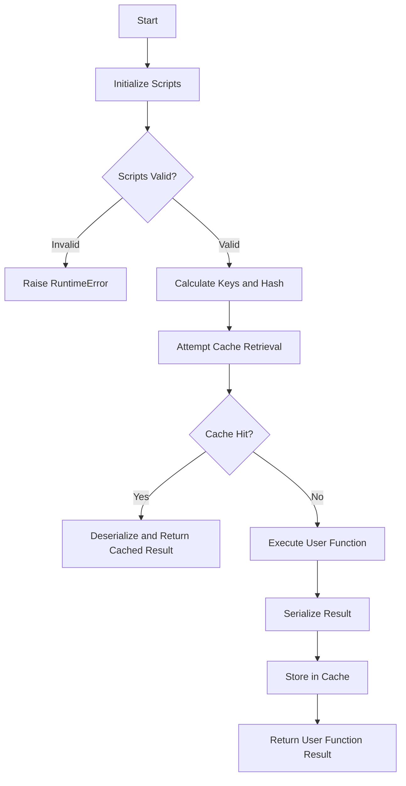
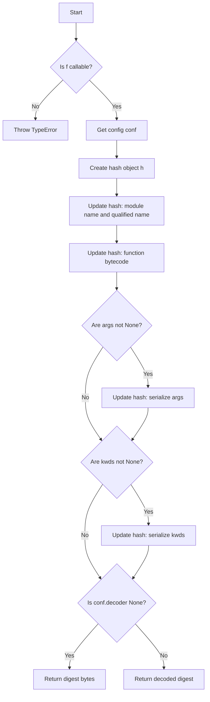
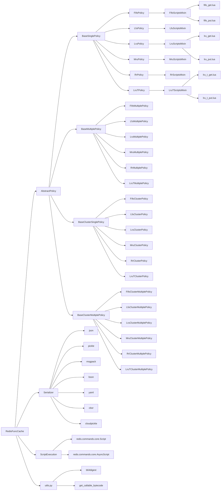
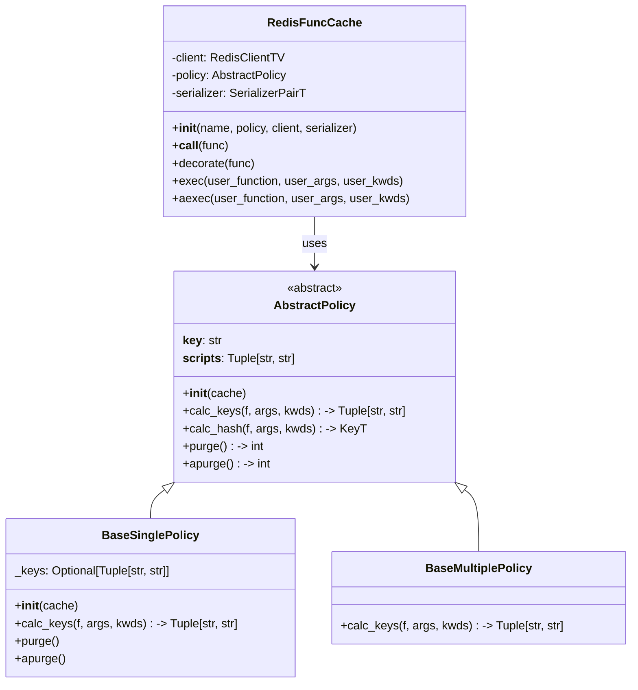
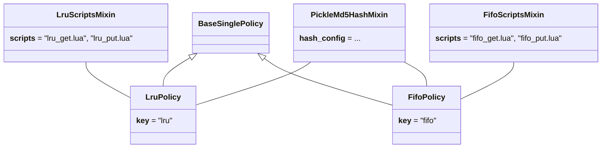
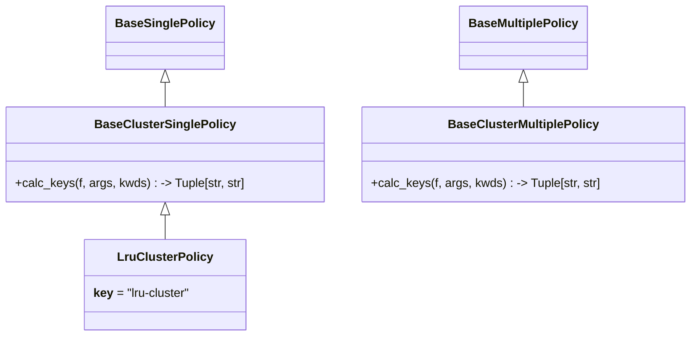
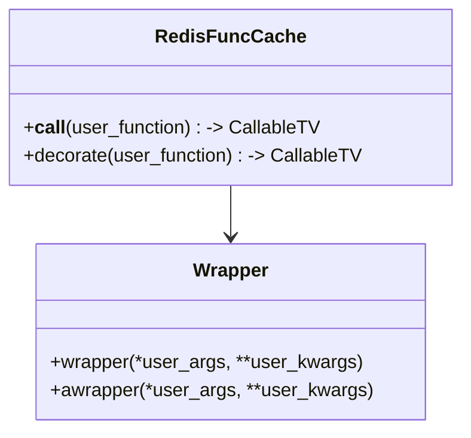
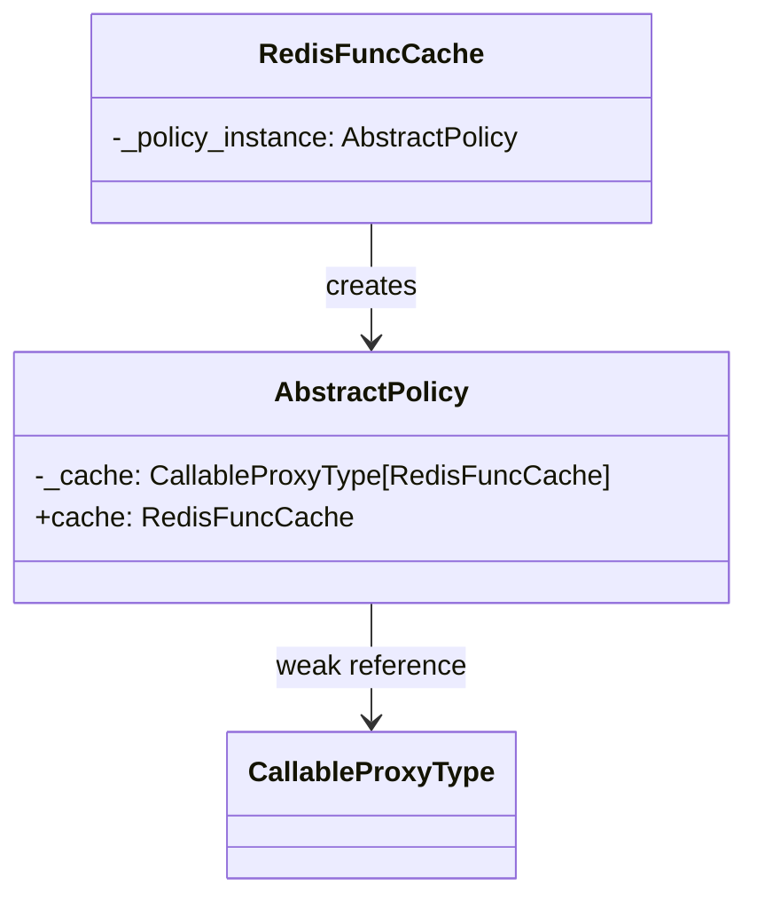

# redis_func_cache

[](https://github.com/tanbro/redis_func_cache/actions/workflows/python-package.yml)
[](https://codecov.io/gh/tanbro/redis_func_cache)
[](https://redis-func-cache.readthedocs.io/)
[](https://pypi.org/project/redis_func_cache/)

> *A Python library that provides decorators for caching function results in Redis, supporting multiple serialization formats and caching strategies, as well as asynchronous operations.*

## Introduction

`redis_func_cache` is a Python library that provides decorators for caching function results in Redis, similar to the caching functionality offered by the standard library. Like the [`functools`](https://docs.python.org/library/functools.html) module, it includes useful decorators such as [`lru_cache`](https://docs.python.org/library/functools.html#functools.lru_cache), which are valuable for implementing memoization.

When you need to cache function return values across multiple processes or machines, [Redis][] can be used as a distributed backend. The purpose of this project is to provide simple and clean decorator functions to use Redis as a cache backend. It implements caches with various eviction/replacement policies such as LRU, FIFO, RR, and LFU. (Refer to [Cache Replacement Policies on Wikipedia](https://wikipedia.org/wiki/Cache_replacement_policies) for more details.)

Here is a simple example:

1. First, start up a Redis server at 127.0.0.1:6379, e.g.:

   ```bash
   docker run -it --rm -p 6379:6379 redis:alpine
   ```

1. Then install the library in your Python environment:

   ```bash
   pip install redis_func_cache
   ```

1. Finally, run the following Python code:

   ```python
   import asyncio
   from time import time
   import redis.asyncio
   from redis_func_cache import LruTPolicy, RedisFuncCache as Cache

   # Create a redis client
   rc = redis.asyncio.Redis.from_url("redis://")

   # Create an LRU cache, connecting to Redis using the previously created redis client
   cache = Cache(__name__, LruTPolicy, rc)

   # Decorate a function to cache its result
   @cache
   async def a_slow_func():
       t = time()
       await asyncio.sleep(10)  # Sleep to simulate a slow operation
       return f"actual duration: {time() - t}"

   with asyncio.Runner() as runner:
       t = time()
       r = runner.run(a_slow_func())
       print(f"duration={time() - t}, {r=}")

       t = time()
       r = runner.run(a_slow_func())
       print(f"duration={time() - t}, {r=}")
   ```

The output should look like:

```
duration=10.117542743682861, r='1755924146.8998647 ... 1755924156.9133286'
duration=0.001995563507080078, r='1755924146.8998647 ... 1755924156.9133286'
```

We can see that the second call to `a_slow_func()` is served from the cache, which is much faster than the first call, and its result is same as the first call.

## Features

- Built on [redis-py][], the official Python client for [Redis][].
- Simple [decorator][] syntax supporting both **`async`** and common functions, **asynchronous** and synchronous I/O.
- Support [Redis][] **cluster**.
- Multiple caching policies: LRU, FIFO, LFU, RR ...
- Serialization formats: JSON, Pickle, MsgPack, YAML, BSON, CBOR ...

## Installation

- Install from PyPI:

    ```bash
    pip install redis_func_cache
    ```

- Install from source:

    ```bash
    git clone https://github.com/tanbro/redis_func_cache.git
    cd redis_func_cache
    pip install .
    ```

- Or install from Github directly:

    ```bash
    pip install git+https://github.com/tanbro/redis_func_cache.git@main
    ```

The library supports [hiredis](https://github.com/redis/hiredis). Installing it can significantly improve performance. It is an optional dependency and can be installed by running: `pip install redis_func_cache[hiredis]`.

If [Pygments](https://pygments.org/) is installed, the library will automatically remove comments and empty lines from Lua scripts evaluated on the [Redis](https://redis.io/) server, which can slightly improve performance. *Pygments* is also an optional dependency and can be installed by running: `pip install redis_func_cache[pygments]`.

## Data structure

The library combines a pair of [Redis][] data structures to manage cache data:

- The first is a sorted set, which stores the hash values of the decorated function calls along with a score for each item.

    When the cache reaches its maximum size, the score is used to determine which item to evict.

- The second is a hash map, which stores the hash values of the function calls and their corresponding return values.

This can be visualized as follows:


The main idea of the eviction policy is that the cache keys are stored in a set, and the cache values are stored in a hash map. Eviction is performed by removing the lowest-scoring item from the set, and then deleting the corresponding field and value from the hash map.

Here is an example showing how the *LRU* cache's eviction policy works (maximum size is 3):


The [`RedisFuncCache`][] executes a decorated function with specified arguments and caches its result. Here's a breakdown of the steps:

1. **Initialize Scripts**: Retrieve two Lua script objects for cache hit and update from `policy.lua_scripts`.
1. **Calculate Keys and Hash**: Compute the cache keys using `policy.calc_keys`, compute the hash value using `policy.calc_hash`, and compute any additional arguments using `policy.calc_ext_args`.
1. **Attempt Cache Retrieval**: Attempt to retrieve a cached result. If a cache hit occurs, deserialize and return the cached result.
1. **Execute User Function**: If no cache hit occurs, execute the decorated function with the provided arguments and keyword arguments.
1. **Serialize Result and Cache**: Serialize the result of the user function and store it in Redis.
1. **Return Result**: Return the result of the decorated function.



## Concurrency and atomicity

The library guarantees thread safety and concurrency security through the following design principles:

1. Redis Concurrency

   - The underlying redis-py client is not thread-safe. Each thread should use a separate client instance or a connection pool (`redis.ConnectionPool`) to avoid resource contention.
   - It is recommended to use a factory pattern with thread-safe locking for client instantiation, preventing race conditions during connection creation. A pre-configured connection pool helps manage Redis connections efficiently and prevents exhaustion under high concurrency.
   - All Redis operations (e.g., get, put) are executed via Lua scripts to ensure atomicity, preventing race conditions during concurrent access.

   Here is an example using `redis.ConnectionPool` to avoid conflicts when the cache accesses Redis:

   ```python
   import redis
   from redis_func_cache import RedisFuncCache, LruPolicy

   redis_pool = redis.ConnectionPool(...)  # Use a pool, not a single client
   redis_factory = lambda: redis.from_pool(redis_pool)  # Use factory, not a static client

   cache = RedisFuncCache(__name__, LruPolicy, redis_factory)

   @cache
   def your_concurrent_func(...):
       ...
   ```

1. Function Execution Concurrency

   Both synchronous and asynchronous functions decorated by RedisFuncCache are executed as-is. Therefore, each function is responsible for its own thread, coroutine or process safety.
   The only concurrency risk lies in Redis I/O and operations. The cache will use a synchronous Redis client for synchronous functions and an asynchronous Redis client for asynchronous functions.
   As described above, you should provide an appropriate Redis client or factory to the cache in concurrent scenarios.

1. Contextual State Isolation

   The [ContextVar](https://docs.python.org/3/library/contextvars.html#contextvars.ContextVar) based `mode_context()` context manager and other cache control context managers ensure thread and coroutine isolation. Each thread or async task maintains its own independent state, preventing cross-context interference.

Atomicity is a key feature of this library. All cache operations (both read and write) are implemented using Redis Lua scripts, which are executed atomically by the Redis server. This means that each script runs in its entirety without being interrupted by other operations, ensuring data consistency even under high concurrent load.

Each cache policy implements two Lua scripts:
- A "get" script that attempts to retrieve a value from cache and updates access information
- A "put" script that adds or updates a value in cache and performs eviction if necessary

These scripts operate on the cache data structures (a sorted set for tracking items and a hash map for storing values) in a single atomic operation. This prevents race conditions that could occur if multiple Redis commands were issued separately.

For Redis Cluster deployments, it's important to note that atomicity is guaranteed only within a single key's hash slot. Since our implementation uses two keys (a sorted set and a hash map) for each cache instance, both keys are designed to belong to the same hash slot. The cluster policies automatically calculate key slots to ensure that all cache data for a single cache instance is always located on the same node in the cluster. This design guarantees that cache operations can be executed atomically within the cluster environment.

Theses designs enable safe operation in both multi-threaded and asynchronous environments while maintaining high-performance Redis I/O throughput. For best results, use the library with Redis 6.0 or newer to take advantage of native Lua script atomicity and advanced connection management features.

## Usage

### A simple example

Using an *LRU* cache to decorate a recursive Fibonacci function:

> 💡 **Tip**: \
> `RedisFuncCache` is not effective for recursive functions, use standard library's `functools.lru_cache` for production instead.

```python
from redis import Redis
from redis_func_cache import RedisFuncCache as Cache, LruTPolicy

redis_factory = lambda: Redis("redis://")

lru_cache = Cache("my-first-lru-cache", LruTPolicy, redis_factory)

@lru_cache
def fib(n):
    if n <= 1:
        return n
    if n == 2:
        return 1
    return fib(n - 1) + fib(n - 2)
```

In this example, we first create a [Redis][] client, then create a [`RedisFuncCache`][] instance with the [Redis][] client and [`LruTPolicy`][] as its arguments.
Next, we use the `@lru_cache` [decorator][] to decorate the `fib` function.
This way, each computed result is cached, and subsequent calls with the same parameters retrieve the result directly from the cache, thereby improving performance.

It works almost the same as the standard library's `functools.lru_cache`, except that it uses [Redis][] as the backend instead of the local machine's memory.

If we browse the [Redis][] database, we can find the pair of keys' names look like:

- `func-cache:my-first-lru-cache:lru_t:0`

    The key (with `0` suffix) is a sorted set that stores the hash of function invocations and their corresponding scores.

- `func-cache:my-first-lru-cache:lru_t:1`

    The key (with `1` suffix) is a hash map. Each key field in it is the hash value of a function invocation, and the value field is the return value of the function.

> ❗ **Important:**\
> The `name` **MUST** be unique for each [`RedisFuncCache`][] instance.
> Therefore, we need to choose a unique name carefully using the `name` argument.

### Async functions

To decorate async functions, you should pass an `Async Redis client` to [`RedisFuncCache`][]'s `client` argument:

```python
from redis.asyncio import Redis as AsyncRedis
from redis_func_cache import RedisFuncCache as Cache, LruTPolicy

redis_factory = lambda: AsyncRedis.from_url("redis://")
cache = Cache(__name__, LruTPolicy, redis_factory)

@cache
async def my_async_func(...):
    ...
```

> ❗ **Attention:**
>
> - When a [`RedisFuncCache`][] is created with an async [Redis][] client, it can only be used to decorate async functions. These async functions will be decorated with an asynchronous wrapper, and the I/O operations between the [Redis][] client and server will be performed asynchronously.
> - Conversely, a synchronous [`RedisFuncCache`][] can only decorate synchronous functions. These functions will be decorated with a synchronous wrapper, and I/O operations with [Redis][] will be performed synchronously.

### Eviction policies

If you want to use other eviction policies, you can specify another policy class as the second argument of [`RedisFuncCache`][].
For example, we use [`FifoPolicy`][] to implement a *FIFO* cache:

```python
from redis import Redis
from redis_func_cache import RedisFuncCache, FifoPolicy

redis_client = Redis.from_url("redis://")
fifo_cache = RedisFuncCache("my-cache-2", FifoPolicy, redis_client)

@fifo_cache
def func1(x):
    ...
```

Use [`RrPolicy`][] to implement a random-remove cache:

```python
from redis import Redis
from redis_func_cache import RedisFuncCache, RrPolicy

redis_client = Redis.from_url("redis://")
rr_cache = RedisFuncCache("my-cache-3", RrPolicy, redis_client)

@rr_cache
def func2(x):
    ...
```

So far, the following cache eviction policies are available:

- **[`LruTPolicy`][]**

    > 💡 **Tip:**\
    > *LRU-T* stands for *LRU on timestamp*. It is a pseudo-LRU policy that approximates the behavior of LRU but is not as precise. The policy removes items based on their invocation timestamps, which may not always accurately reflect the least recently used item due to potential timestamp inaccuracies.
    >
    > Despite this limitation, *LRU-T* is **highly recommended** for common use cases. It offers better performance compared to the traditional LRU policy and provides sufficient accuracy for most applications.

- [`FifoPolicy`][]: first in, first out
- [`LfuPolicy`][]: least frequently used
- [`LruPolicy`][]: least recently used
- [`MruPolicy`][]: most recently used
- [`RrPolicy`][]: random remove
- ...

> ℹ️ **Info:**\
> Explore the source code in the directory `src/redis_func_cache/policies` for more details.

### Multiple [Redis][] key pairs

As described above, the cache keys are currently in a paired form, where all decorated functions share the same two keys.
However, there may be instances where we want a unique key pair for each decorated function.

One solution is to use different [`RedisFuncCache`][] instances to decorate different functions.

Another way is to use a policy that stores cache data in different [Redis][] key pairs for each function. There are several policies to do that out of the box.
For example, we can use [`LruTMultiplePolicy`][] for an *LRU* cache that has multiple different [Redis][] key pairs to store return values of different functions, and each function has a standalone key pair:

```python
from redis import  Redis
from redis_func_cache import RedisFuncCache, LruTMultiplePolicy

redis_client = Redis.from_url("redis://")
cache = RedisFuncCache("my-cache-4", LruTMultiplePolicy, redis_client)

@cache
def func1(x):
    ...

@cache
def func2(x):
    ...
```

In the example, [`LruTMultiplePolicy`][] inherits from [`BaseMultiplePolicy`][] which implements how to store cache keys and values for each function.

When called, we can see such keys in the [Redis][] database:

- key pair for `func1`:

  - `func-cache:my-cache-4:lru_t-m:__main__:func1#<hash1>:0`
  - `func-cache:my-cache-4:lru_t-m:__main__:func1#<hash1>:1`

- key pair for `func2`:

  - `func-cache:my-cache-4:lru_t-m:__main__:func2#<hash2>:0`
  - `func-cache:my-cache-4:lru_t-m:__main__:func2#<hash2>:1`

where `<hash1>` and `<hash2>` are the hash values of the definitions of `func1` and `func2` respectively.

Policies that store cache in multiple [Redis][] key pairs are:

- [`FifoMultiplePolicy`][]
- [`LfuMultiplePolicy`][]
- [`LruMultiplePolicy`][]
- [`MruMultiplePolicy`][]
- [`RrMultiplePolicy`][]
- [`LruTMultiplePolicy`][]

### [Redis][] Cluster support

We already know that the library implements cache algorithms based on a pair of [Redis][] data structures, and the two **MUST** be in the same [Redis][] node, or it will not work correctly.

While a [Redis][] cluster will distribute keys to different nodes based on the hash value, we need to guarantee that two keys are placed on the same node. Several cluster policies are provided to achieve this. These policies use the `{...}` pattern in key names.

For example, here we use a [`LruTClusterPolicy`][] to implement a cluster-aware *LRU* cache:

```python
from redis import Redis
from redis_func_cache import RedisFuncCache, LruTClusterPolicy

redis_client = Redis.from_url("redis://")
cache = RedisFuncCache("my-cluster-cache", LruTClusterPolicy, redis_client)

@cache
def my_func(x):
    ...
```

Thus, the names of the key pair may look like:

- `func-cache:{my-cluster-cache:lru_t-c}:0`
- `func-cache:{my-cluster-cache:lru_t-c}:1`

Notice what is in `{...}`: the [Redis][] cluster will determine which node to use by the `{...}` pattern rather than the entire key string.

Therefore, all cached results for the same cache instance will be stored in the same node, irrespective of the functions involved.

Policies that support clusters are:

- [`FifoClusterPolicy`][]
- [`LfuClusterPolicy`][]
- [`LruClusterPolicy`][]
- [`MruClusterPolicy`][]
- [`RrClusterPolicy`][]
- [`LruTClusterPolicy`][]

### [Redis][] Cluster support with multiple key pairs

This policy ensures that all cached results for the same function are stored in the same node. Meanwhile, results of different functions may be stored in different nodes.

Policies that support both clusters and store cache in multiple [Redis][] key pairs are:

- [`FifoClusterMultiplePolicy`][]
- [`LfuClusterMultiplePolicy`][]
- [`LruClusterMultiplePolicy`][]
- [`MruClusterMultiplePolicy`][]
- [`RrClusterMultiplePolicy`][]
- [`LruTClusterMultiplePolicy`][]

### Max size and expiration time

The [`RedisFuncCache`][] instance has two arguments to control the maximum size and expiration time of the cache:

- `maxsize`: The maximum number of items the cache can hold.

    When the cache reaches its `maxsize`, adding a new item will cause an existing cached item to be removed according to the eviction policy.

    > ℹ️ **Note:**\
    > For "multiple" policies, each decorated function has its own standalone data structure, so the value represents the maximum size of each individual data structure.

    This argument can be set when creating a cache instance:

    ```python
    cache = RedisFuncCache("my-cache-5", LruTPolicy, redis_client, maxsize=100)
    ```

- `ttl`: The expiration time (in seconds) for the cache data structure.

    The entire [Redis][] data structure for the cache will expire and be removed after the specified time.
    Each time the cache is accessed, its expiration time is refreshed. Thus, the cache will only be removed if it is not accessed within the specified period.

    > ℹ️ **Note:**\
    > For "multiple" policies, each decorated function has its own separate data structure, so the `ttl` value applies to each individual structure. The expiration time is refreshed independently whenever each cache is accessed.

    You can set this argument when creating a cache instance:

    ```python
    cache = RedisFuncCache("my-cache-5", LruTPolicy, redis_client, ttl=300)
    ```

- per-invocation TTL: (Experimental) The expiration time (in seconds) for each cached item, not the entire cache.

  You can set this argument when decorating a function:

  ```python
  @cache(ttl=300)
  def my_func(x):
      ...
  ```

  This means that each cached return value for a specific invocation of `my_func` will expire after 300 seconds.
  The argument's default value is `None`, which means that the cache item will never expire.

  > ⁉️ **Caution:**\
  > This experimental expiration mechanism relies on [Redis Hashes Field expiration](https://redis.io/docs/latest/develop/data-types/hashes/#field-expiration). Expiration only applies to the `HASH` field (the cached return value), and does **not** reduce the total number of items in the cache when a field expires.
  > Typically, the cached return value in the `HASH` portion is automatically released after expiration. However, the corresponding hash key in the `ZSET` portion is **not** removed automatically. Instead, it is only "lazily" cleaned up when accessed, or removed by the eviction policy when a new value is added. During this period, the `ZSET` portion continues to occupy memory, and the reported number of cache items does not decrease.

  > ⚠️ **Warning:**\
  > This feature is experimental and requires [Redis][] 7.4 or above.

### Complex return types

The return value's (de)serializer is [JSON][] (`json` module of std-lib) by default, which does not work with complex objects.
However, we can still use [`pickle`][]. This can be achieved by specifying either the `serializer` argument of [`RedisFuncCache`][]'s constructor (`__init__`), or the decorator (`__call__`):

> 💡 **Example:**
>
> ```python
> import pickle
> from redis import Redis
> from redis_func_cache import RedisFuncCache, LruTPolicy
>
> # like this:
> my_pickle_cache = RedisFuncCache(
>     __name__,
>     LruTPolicy,
>     lambda: Redis.from_url("redis://"),
>     serializer="pickle", # by string
> )
>
> # or like this:
> my_pickle_cache1 = RedisFuncCache(
>     __name__,
>     LruTPolicy,
>     lambda: Redis.from_url("redis://"),
>     serializer=(pickle.dumps, pickle.loads) # by tuple of serializer/deserializer functions
> )
>
> # or like this:
> cache = RedisFuncCache(__name__, LruTPolicy, lambda: Redis.from_url("redis://"))
>
> @cache(serializer=(pickle.loads, pickle.dumps)) # set serializer/deserializer in decorator, override that in cache instance
> def my_func_with_complex_return_value(x):
>     ...
>
> # or just like this:
> @cache(serializer="pickle") # set serializer/deserializer in decorator, override that in cache instance
> def my_func_with_complex_return_value(x):
>     ...
>
> ```

Other serialization libraries such as [bson][], [simplejson](https://pypi.org/project/simplejson/), [cJSON](https://github.com/DaveGamble/cJSON), [msgpack][], [yaml][], and [cloudpickle](https://github.com/cloudpipe/cloudpickle) are also supported.

> ⚠️ **Warning:** \
> The [`pickle`][] module is highly powerful but poses a significant security risk because it can execute arbitrary code during deserialization. Use it with extreme caution, especially when handling data from untrusted sources.
> For best practices, it is recommended to cache functions that return simple, [JSON][]-serializable data. If you need to serialize more complex data structures than those supported by [JSON][], consider using safer alternatives such as [bson][], [msgpack][], or [yaml][].

### Work with Un-Serializable Arguments

As mentioned in the documentation, the [`RedisFuncCache`][] class does not support functions with un-serializable arguments.
However, you can work around this issue by:

- Splitting the function into two parts: one with fully serializable arguments (apply the cache decorator to this part), and another that may contain un-serializable arguments (this part calls the first one).

- Using `excludes` and/or `excludes_positional` to exclude un-serializable arguments from key and hash calculations.

  This approach is particularly useful for functions that takes arguments such as database connections, session objects, or other non-serializable objects. The `excludes` and `excludes_positional` parameters allow you to exclude specific arguments from cache key and hash calculations.

The `excludes` parameter takes a sequence of parameter names to exclude from cache key generation:

```python
from redis_func_cache import RedisFuncCache

cache = RedisFuncCache("my_cache", LruPolicy, redis_client)

@cache(excludes=["session", "config"])
def get_user_data(session, user_id: int, config=None):
    # session and config are excluded from cache key
    return fetch_user_data(user_id)

# These calls will hit the same cache entry because user_id is the same
data1 = get_user_data(session1, user_id=123, config=config1)
data2 = get_user_data(session2, user_id=123, config=config2)  # Cache hit
```

The `excludes_positional` parameter takes a sequence of indices specifying positional arguments to exclude:

```python
@cache(excludes_positional=[0, 2])  # Exclude 1st and 3rd arguments
def get_user_data(session, user_id: int, config):
    # session (index 0) and config (index 2) are excluded from cache key
    return fetch_user_data(user_id)

# These calls will hit the same cache entry because user_id is the same
data1 = get_user_data(session1, 123, config1)
data2 = get_user_data(session2, 123, config2)  # Cache hit
```

You can use both parameters together to exclude both positional and keyword arguments:

```python
@cache(excludes=["config"], excludes_positional=[0])
def get_user_data(session, user_id: int, book_id: int, config=None):
    # session (positional, index 0) and config (keyword) are excluded
    return fetch_user_data(user_id, book_id)

# These calls will hit the same cache entry because user_id and book_id are the same
data1 = get_user_data(session1, user_id=123, book_id=456, config=config1)
data2 = get_user_data(session2, user_id=123, book_id=456, config=config2)  # Cache hit
```

### TTL Update Behavior

By default, accessing cached data updates the expiration time (TTL) of the cache data structures. This behavior is referred to as "sliding TTL". However, you can control this behavior using the `update_ttl` parameter.

There are two TTL update modes:

- **Sliding TTL** (`update_ttl=True`, default): Each cache access (both read and write) extends the life of the cache data structures.
- **Fixed TTL** (`update_ttl=False`): The expiration time is set only when the cache data structures are first created, and subsequent accesses do not extend their life.

You can set the `update_ttl` parameter at the cache instance level:

```python
# Sliding TTL (default behavior)
sliding_cache = RedisFuncCache("sliding-cache", LruTPolicy, redis_client, update_ttl=True)

# Fixed TTL
fixed_cache = RedisFuncCache("fixed-cache", LruTPolicy, redis_client, update_ttl=False)
```

The `update_ttl` parameter controls the behavior of the cache data structures (sorted set and hash map) as a whole, not individual cached items. It is independent of the per-item TTL (set via the `ttl` parameter in the decorator), which controls the expiration of individual cached function results.

> 💡 **Tip:**\
> Use fixed TTL when you want predictable cache expiration behavior, regardless of how often cached functions are accessed.
> Use sliding TTL when you want frequently accessed cached data to remain in cache longer.

### Cache Mode Control

The library provides fine-grained control over cache behavior through the `mode_context()` context manager and convenience methods. You can control whether the cache reads from or writes to Redis using the following flags:

- `read` (`bool`): allow read from cache
- `write` (`bool`): allow write to cache
- `exec` (`bool`): allow execute function

You can use the `mode_context()` context manager to explicitly set any mode:

```python
from redis_func_cache import RedisFuncCache

@cache
def get_user_data(user_id):
    # Some expensive operation
    return data

# Normal operation (default)
data = get_user_data(123)

# Bypass cache reading, but still write to cache
mode = cache.get_mode()
mode.read = False
with cache.mode_context(mode):
    data = get_user_data(123)  # Function executed, result stored in cache

# Only read from cache, don't execute function or write to cache
mode = cache.get_mode()
mode.write = False
with cache.mode_context(mode):
    data = get_user_data(123)  # Only attempts to read from cache

# Disable cache read and write
mode = cache.get_mode()
mode.read = False
mode.write = False
with cache.mode_context(mode):
    data = get_user_data(123)  # Function executed, no cache interaction
```

For common use cases, you can use convenience methods:

```python
with cache.disable_rw():
    data = get_user_data(123)

with cache.write_only():
    data = get_user_data(123)

with cache.read_only():
    data = get_user_data(123)
```

All these methods are used as context managers and are based on [`ContextVar`](https://docs.python.org/3/library/contextvars.html#contextvars.ContextVar), making them thread-safe and concurrency-isolated.

## Advanced Usage

### Custom result serializer

The result of the decorated function is serialized by default using [JSON][] (via the json module from the standard library) and then saved to [Redis][].

To utilize alternative serialization methods, such as [msgpack][], you have two options:

1. Specify the `serializer` argument in the constructor of [`RedisFuncCache`][], where the argument is a tuple of `(serializer, deserializer)`, or the name of the serializer function:

   This method applies globally: all functions decorated by this cache will use the specified serializer.

   For example:

   ```python
   import bson
   from redis import Redis
   from redis_func_cache import RedisFuncCache, LruTPolicy

   def serialize(x):
      return bson.encode({"return_value": x})

   def deserialize(x):
      return bson.decode(x)["return_value"]

   cache = RedisFuncCache(
       __name__,
       LruTPolicy,
       lambda: Redis.from_url("redis://"),
       serializer=(serialize, deserialize)
    )

   @cache
   def func():
      ...
   ```

1. Specify the `serializer` argument directly in the decorator. The argument should be a tuple of (`serializer`, `deserializer`) or simply the name of the serializer function.

   This method applies on a per-function basis: only the decorated function will use the specified serializer.

   For example:

   - We can use [msgpack][] as the serializer to cache functions whose return value is binary data, which is not possible with [JSON][].
   - We can use [bson][] as the serializer to cache functions whose return value is a `datetime` object, which cannot be handled by either [JSON][] or [msgpack][].

   ```python
   import msgpack
   from redis import Redis
   from redis_func_cache import RedisFuncCache, LruTPolicy

   cache = RedisFuncCache(__name__, LruTPolicy, lambda: Redis.from_url("redis://"))

   @cache(serializer=(msgpack.packb, msgpack.unpackb))
   def create_or_get_token(user: str) -> bytes:
      from secrets import token_bytes
      return token_bytes(32)

   @cache(serializer="bson")
   def now_time():
       from datetime import datetime
       return datetime.now()
   ```

### Custom key format

An instance of [`RedisFuncCache`][] calculates key pair names by calling the `calc_keys` method of its policy.
There are four basic policies that implement respective kinds of key formats:

- [`BaseSinglePolicy`][]: All functions share the same key pair, [Redis][] cluster is NOT supported.

    The format is: `<prefix><name>:<__key__>:<0|1>`

- [`BaseMultiplePolicy`][]: Each function has its own key pair, [Redis][] cluster is NOT supported.

    The format is: `<prefix><name>:<__key__>:<function_name>#<function_hash>:<0|1>`

- [`BaseClusterSinglePolicy`][]: All functions share the same key pair, [Redis][] cluster is supported.

    The format is: `<prefix>{<name>:<__key__>}:<0|1>`

- [`BaseClusterMultiplePolicy`][]: Each function has its own key pair, and [Redis][] cluster is supported.

    The format is: `<prefix><name>:<__key__>:<function_name>#{<function_hash>}:<0|1>`

Variables in the format string are defined as follows:

|                 |                                                                   |
| --------------- | ----------------------------------------------------------------- |
| `prefix`        | `prefix` argument of [`RedisFuncCache`][]                         |
| `name`          | `name` argument of [`RedisFuncCache`][]                           |
| `__key__`       | `__key__` attribute of the policy class used in [`RedisFuncCache`][] |
| `function_name` | full name of the decorated function                               |
| `function_hash` | hash value of the decorated function                              |

`0` and `1` at the end of the keys are used to distinguish between the two data structures:

- `0`: a sorted or unsorted set, used to store the hash value and sorting score of function invocations
- `1`: a hash table, used to store the return value of the function invocation

If you want to use a different format, you can subclass [`AbstractPolicy`][] or any of the above policy classes, and implement the `calc_keys` method, then pass the custom policy class to [`RedisFuncCache`][].

The following example demonstrates how to customize the key format for an *LRU* policy:

```python
from __future__ import annotations

from typing import TYPE_CHECKING, Any, Callable, Mapping, Sequence, Tuple, override

import redis
from redis_func_cache import RedisFuncCache
from redis_func_cache.policies.abstract import AbstractPolicy
from redis_func_cache.mixins.hash import PickleMd5HashMixin
from redis_func_cache.mixins.scripts import LruScriptsMixin

if TYPE_CHECKING:
    from redis.typing import KeyT


def redis_factory():
    return redis.from_url("redis://")


MY_PREFIX = "my_prefix"


class MyPolicy(LruScriptsMixin, PickleMd5HashMixin, AbstractPolicy):
    __key__ = "my_key"

    @override
    def calc_keys(
            self, f: Callable | None = None, args: Sequence | None = None, kwds: Mapping[str, Any] | None = None
    ) -> Tuple[KeyT, KeyT]:
        k = f"{self.cache.prefix}-{self.cache.name}-{f.__name__}-{self.__key__}"
        return f"{k}-set", f"{k}-map"


my_cache = RedisFuncCache(name="my_cache", policy=MyPolicy, client=redis_factory, prefix=MY_PREFIX)


@my_cache
def my_func(*args, **kwargs):
    ...
```

In the example, we'll get a cache that generates [Redis][] keys separated by `-`, instead of `:`, prefixed by `"my-prefix"`, and suffixed by `"set"` and `"map"`, rather than `"0"` and `"1"`. The key pair names could be like `my_prefix-my_cache_func-my_key-set` and `my_prefix-my_cache_func-my_key-map`.

`LruScriptsMixin` tells the policy which Lua script to use, and `PickleMd5HashMixin` tells the policy to use [`pickle`][] to serialize and `md5` to calculate the hash value of the function.

> ❗ **Important:**\
> The calculated key name **SHOULD** be unique for each [`RedisFuncCache`][] instance.
>
> [`BaseSinglePolicy`][], [`BaseMultiplePolicy`][], [`BaseClusterSinglePolicy`][], and [`BaseClusterMultiplePolicy`][] calculate their key names by calling the `calc_keys` method, which uses their `__key__` attribute and the `name` property of the [`RedisFuncCache`][] instance.
> If you subclass any of these classes, you should override the `__key__` attribute to ensure that the key names remain unique.

### Custom Hash Algorithm

When the library performs a get or put action with [Redis][], the hash value of the function invocation will be used.

For the sorted set data structures, the hash value will be used as the member. For the hash map data structure, the hash value will be used as the hash field.

The algorithm used to calculate the hash value is defined in `AbstractHashMixin`, and can be described as below:

```python
import hashlib

class AbstractHashMixin:
    __hash_config__ = ...

    ...

    def calc_hash(self, f = None, args = None, kwds = None):
        if not callable(f):
            raise TypeError(f"Cannot calculate hash for {f=}")
        conf = self.__hash_config__
        h = hashlib.new(conf.algorithm)
        h.update(f"{f.__module__}:{f.__qualname__}".encode())
        h.update(f.__code__.co_code)
        if args is not None:
            h.update(conf.serializer(args))
        if kwds is not None:
            h.update(conf.serializer(kwds))
        if conf.decoder is None:
            return h.digest()
        return conf.decoder(h)
```

As the code snippet above shows, the hash value is calculated by the full name of the function, the bytecode of the function, and the arguments and keyword arguments — they are serialized and hashed, then decoded.

The serializer and decoder are defined in the `__hash_config__` attribute of the policy class and are used to serialize arguments and decode the resulting hash. By default, the serializer is [`pickle`][] and the decoder uses the md5 algorithm. If no decoder is specified, the hash value is returned as bytes.

This configuration can be illustrated as follows:



If we want to use a different algorithm, we can select a mixin hash class defined in `src/redis_func_cache/mixins/hash.py`. For example:

- To serialize the function with [JSON][], use the SHA1 hash algorithm, store hex string in redis, you can choose the `JsonSha1HexHashMixin` class.
- To serialize the function with [`pickle`][], use the MD5 hash algorithm, store base64 string in redis, you can choose the `PickleMd5Base64HashMixin` class.

These mixin classes provide alternative hash algorithms and serializers, allowing for flexible customization of the hashing behavior. The following example shows how to use the `JsonSha1HexHashMixin` class:

```python
from redis import Redis
from redis_func_cache import RedisFuncCache
from redis_func_cache.policies.abstract import AbstractPolicy
from redis_func_cache.mixins.hash import JsonSha1HexHashMixin
from redis_func_cache.mixins.scripts import LruScriptsMixin


class MyLruPolicy(LruScriptsMixin, JsonSha1HexHashMixin, AbstractPolicy):
    __key__ = "my-lru"

my_json_sha1_hex_cache = RedisFuncCache(
    name="json_sha1_hex",
    policy=MyLruPolicy,
    client=lambda: Redis.from_url("redis://")
)
```

Or even write an entire new algorithm. For that, we subclass `AbstractHashMixin` and override the `calc_hash` method. For example:

```python
from __future__ import annotations

import hashlib
from typing import TYPE_CHECKING, override, Any, Callable, Mapping, Sequence
import cloudpickle
from redis import Redis
from redis_func_cache import RedisFuncCache
from redis_func_cache.policies.abstract import AbstractPolicy
from redis_func_cache.mixins.hash import AbstractHashMixin
from redis_func_cache.mixins.scripts import LruScriptsMixin

if TYPE_CHECKING:  # pragma: no cover
    from redis.typing import KeyT


class MyHashMixin(AbstractHashMixin):
    @override
    def calc_hash(
        self,
        f: Callable | None = None,
        args: Sequence | None = None,
        kwds: Mapping[str, Any] | None = None
    ) -> KeyT:
        assert callable(f)
        dig = hashlib('balck2b')
        dig.update(f.__qualname__.encode())
        dig.update(cloudpickle.dumps(args))
        dig.update(cloudpickle.dumps(kwds))
        return dig.hexdigest()


class MyLruPolicy2(LruScriptsMixin, MyHashMixin, AbstractPolicy):
    __key__ = "my-lru2"


my_custom_hash_cache = RedisFuncCache(
    name=__name__,
    policy=MyLruPolicy2,
    client=redis_client
)

redis_client = Redis.from_url("redis://")


@my_custom_hash_cache
def some_func(*args, **kwargs):
    ...
```

> 💡 **Tip:**\
> The purpose of the hash algorithm is to ensure the isolation of cached return values for different function invocations.
> Therefore, you can generate unique key names using any method, not just hashes.

## Known Issues

- Cannot decorate a function that has an argument not serializable by [`pickle`][] or other serialization libraries, but we can work around this issue by excluding the argument from the key and hash calculations with `excludes` and/or `excludes_positional` parameters.

  - For a common method defined inside a class, the class must be serializable; otherwise, the first `self` argument cannot be serialized.
  - For a class method (decorated by [`@classmethod`](https://docs.python.org/3/library/functions.html#classmethod)), the class type itself, i.e., the first `cls` argument, must be serializable.

- Compatibility with other [decorator][]s is not guaranteed.

- It cannot hit cache across different Python versions by default. Because:

  - The built-in policies in `policies` use [`pickle`][] to serialize function arguments and then calculate the cache key by hashing the serialized data with `md5` by default.

    [`pickle`][] is chosen because only the hash bytes are stored in Redis, not the serialized data itself, making this approach safe. However, [`pickle`][] causes **incompatibility between different Python versions**.

  - The key calculation defined in `mixins.hash.AbstractHashMixin.calc_hash()` uses the function's bytecode as part of the hash computation by default. So it cannot hit cache across different Python versions.

  If your application needs to be compatible across Python versions, you should disable `use_bytecode` attribute of the mixin's `__hash_config__`, and use a [json][] based hash mixer. Or define your own hash policy using a version-compatible serialization method. For example:

  ```python
  from dataclasses import replace
  from redis_func_cache import RedisFuncCache as Cache
  from redis_func_cache.policies.abstract import BaseSinglePolicy
  from redis_func_cache.mixins.hash import JsonMd5HashMixin
  from redis_func_cache.mixins.scripts import LfuScriptsMixin

  class MyLfuPolicy(LfuScriptsMixin, JsonMd5HashMixin, BaseSinglePolicy):
      __key__ = "my-lfu"

      # Override hash config here !!!
      __hash_config__ = replace(JsonMd5HashMixin.__hash_config__, use_bytecode=False)

  cache = Cache(__name__, policy=MyLfuPolicy, client=redis_client_factory)
  ```

  As shown above, the `JsonMd5HashMixin` uses [json][], which can be used across different Python versions, rather than [`pickle`][]. `use_bytecode` is set to `False` to avoid version compatible problems caused by bytecode.

- The cache eviction policies are mainly based on [Redis][] sorted set's score ordering. For most policies, the score is a positive integer. Its maximum value is `2^32-1` in [Redis][], which limits the number of times of eviction replacement. [Redis][] will return an `overflow` error when the score overflows.

- High concurrency or long-running decorated functions may result in unexpected cache misses and increased I/O operations. This can occur because the result value might not be saved quickly enough before the next call can hit the cache again.

- Generator functions are not supported.

- If there are multiple [`RedisFuncCache`][] instances with the same name, they may share the same cache data.
  This may lead to serious errors, so we should avoid using the same `name` argument for different cache instances.

- The Redis keys generated by *Multiple* policies include a hash derived from Python bytecode, making them **incompatible across Python versions**.

  However, you can define a custom mixin that inherits from `AbstractHashMixin`, in which you can implement your own hash function to support compatibility across Python versions.

  Additionally, the decorator **cannot be used with native or built-in functions** due to same limitation.

## Test

1. Start a Redis server
1. Set up `REDIS_URL` environment variable (Default to `redis://` if not defined) to point to the Redis server.
1. Run the tests:

   ```bash
   python -m unittest
   ```

A Docker Compose file for unit testing is provided in the `docker` directory to simplify the process. You can run it by executing:

```bash
cd docker
docker compose up --abort-on-container-exit
```

## Develop

Clone the project and enter the project directory:

```bash
git clone https://github.com/tanbro/redis_func_cache.git
cd redis_func_cache
```

We can use either the traditional method (`venv` and `pip`) of standard library or [uv][] as the environment manager.

- If using the traditional method, a virtual environment is recommended:

  1. Install a Python development environment on your system. The minimum required Python version is 3.8.

  1. Initialize a virtual environment at sub-directory `.venv`, then activate it:

     - On Unix-like systems:

        ```bash
        python -m venv .venv
        source .venv/bin/activate
        ```

        > 💡 **Tip:** \
        > On some older systems, `python` may be a symbolic link to `python2`. In such cases, you can use `python3` instead.

     - On Windows:

        ```powershell
        python -m venv .venv
        .venv\Scripts\Activate
        ```

        > 💡 **Tip:** \
        > On Windows, the command-line executable for Python may be either `python`, `python3` or `py`, depending on your installation method.

  1. Install the project and its development dependencies:

     ```bash
     pip install -r requirements.txt
     ```

- If using [uv][], it should be installed before starting development.

  After installing [uv][], follow these steps to set up the project:

  1. Prepare a suitable Python development environment:

      If you do not already have Python installed, you can use [uv][] to install it. For example:

      ```bash
      uv python install 3.12
      ```

      Alternatively, you can use any other method to install Python development environments.

  1. Sync the project with all extras and dependencies:

      To install runtime, test, documentation, typing, and development dependencies:

      ```bash
      uv sync --all-groups --all-extras
      ```

      Or, to install only development dependencies:

      ```bash
      uv sync --only-dev
      ```

   A Python virtual environment is created in the `.venv` directory by [uv][] automatically.

We suggest installing [pre-commit][] hooks:

```bash
pre-commit install
```

> ℹ️ **Note:** \
> Ensure that you have a stable internet connection during the installation process to avoid interruptions.

### Module structure



### Class Diagrams

Core class:



Strategy pattern and mixins:



Cluster and multiple-keys support



Decorator and proxy:



Weak reference:



[redis]: https://redis.io/ "Redis is an in-memory data store used by millions of developers as a cache"
[redis-py]: https://redis.io/docs/develop/clients/redis-py/ "Connect your Python application to a Redis database"

[decorator]: https://docs.python.org/glossary.html#term-decorator "A function returning another function, usually applied as a function transformation using the @wrapper syntax"
[json]: https://www.json.org/ "JSON (JavaScript Object Notation) is a lightweight data-interchange format."
[`pickle`]: https://docs.python.org/library/pickle.html "The pickle module implements binary protocols for serializing and de-serializing a Python object structure."

[bson]: https://bsonspec.org/ "BSON, short for Bin­ary JSON, is a bin­ary-en­coded seri­al­iz­a­tion of JSON-like doc­u­ments."
[msgpack]: https://msgpack.org/ "MessagePack is an efficient binary serialization format."
[yaml]: https://yaml.org/ "YAML is a human-friendly data serialization language for all programming languages."

[uv]: https://docs.astral.sh/uv/ "An extremely fast Python package and project manager, written in Rust."
[pre-commit]: https://pre-commit.com/ "A framework for managing and maintaining multi-language pre-commit hooks."

[`RedisFuncCache`]: redis_func_cache.cache.RedisFuncCache
[`AbstractPolicy`]: redis_func_cache.policies.abstract.AbstractPolicy

[`BaseSinglePolicy`]: redis_func_cache.policies.base.BaseSinglePolicy
[`BaseMultiplePolicy`]: redis_func_cache.policies.base.BaseMultiplePolicy
[`BaseClusterSinglePolicy`]: redis_func_cache.policies.base.BaseClusterSinglePolicy
[`BaseClusterMultiplePolicy`]: redis_func_cache.policies.base.BaseClusterMultiplePolicy

[`FifoPolicy`]: redis_func_cache.policies.fifo.FifoPolicy "First In First Out policy"
[`LfuPolicy`]: redis_func_cache.policies.lfu.LfuPolicy "Least Frequently Used policy"
[`LruPolicy`]: redis_func_cache.policies.lru.LruPolicy "Least Recently Used policy"
[`MruPolicy`]: redis_func_cache.policies.mru.MruPolicy "Most Recently Used policy"
[`RrPolicy`]: redis_func_cache.policies.rr.RrPolicy "Random Remove policy"
[`LruTPolicy`]: redis_func_cache.policies.lru.LruTPolicy "Time based Least Recently Used policy."

[`FifoMultiplePolicy`]: redis_func_cache.policies.fifo.FifoMultiplePolicy
[`LfuMultiplePolicy`]: redis_func_cache.policies.lfu.LfuMultiplePolicy
[`LruMultiplePolicy`]: redis_func_cache.policies.lru.LruMultiplePolicy
[`MruMultiplePolicy`]: redis_func_cache.policies.mru.MruMultiplePolicy
[`RrMultiplePolicy`]: redis_func_cache.policies.rr.RrMultiplePolicy
[`LruTMultiplePolicy`]: redis_func_cache.policies.lru.LruTMultiplePolicy

[`FifoClusterPolicy`]: redis_func_cache.policies.fifo.FifoClusterPolicy
[`LfuClusterPolicy`]: redis_func_cache.policies.lfu.LfuClusterPolicy
[`LruClusterPolicy`]: redis_func_cache.policies.lru.LruClusterPolicy
[`MruClusterPolicy`]: redis_func_cache.policies.mru.MruClusterPolicy
[`RrClusterPolicy`]: redis_func_cache.policies.rr.RrClusterPolicy
[`LruTClusterPolicy`]: redis_func_cache.policies.lru.LruTClusterPolicy

[`FifoClusterMultiplePolicy`]: redis_func_cache.policies.fifo.FifoClusterMultiplePolicy
[`LfuClusterMultiplePolicy`]: redis_func_cache.policies.lfu.LfuClusterMultiplePolicy
[`LruClusterMultiplePolicy`]: redis_func_cache.policies.lru.LruClusterMultiplePolicy
[`MruClusterMultiplePolicy`]: redis_func_cache.policies.mru.MruClusterMultiplePolicy
[`RrClusterMultiplePolicy`]: redis_func_cache.policies.rr.RrClusterMultiplePolicy
[`LruTClusterMultiplePolicy`]: redis_func_cache.policies.lru.LruTClusterMultiplePolicy
