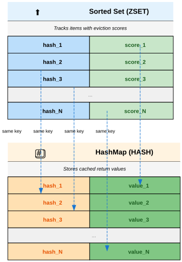
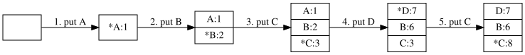
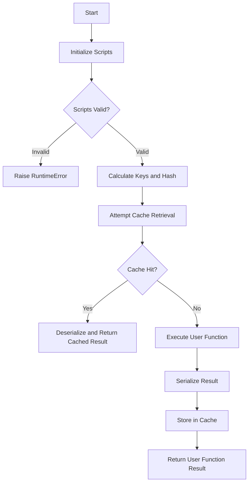
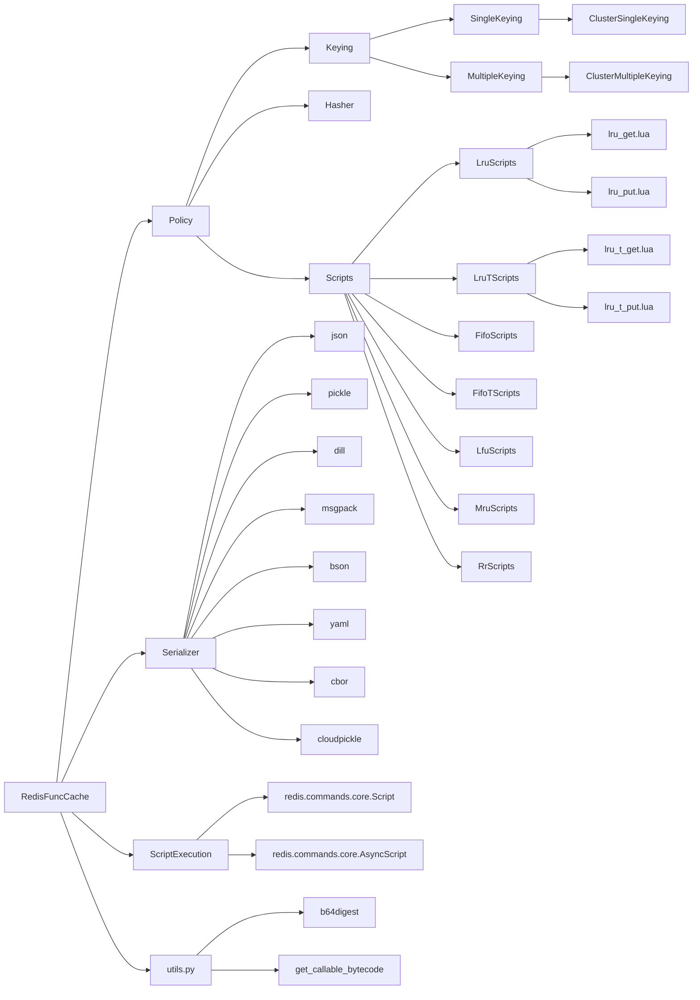
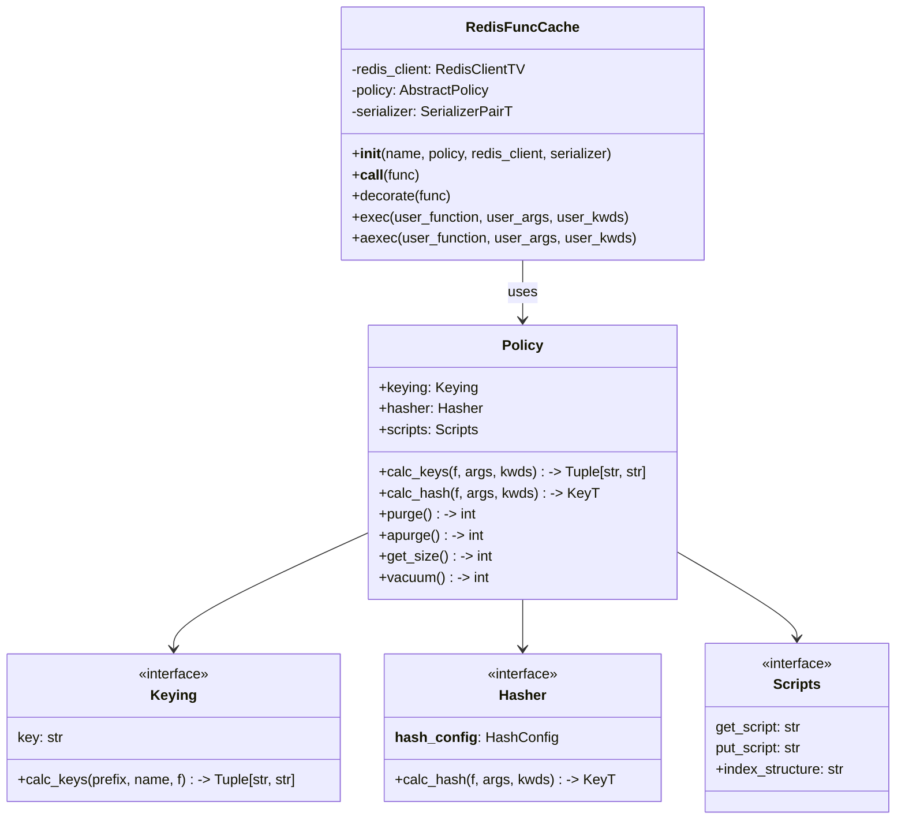
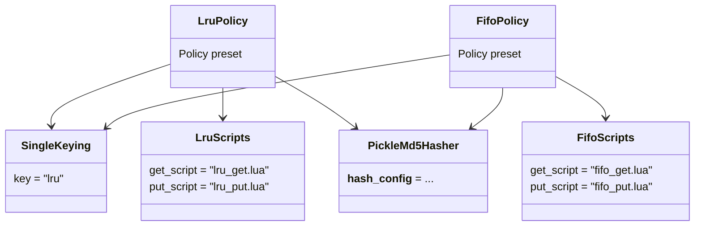
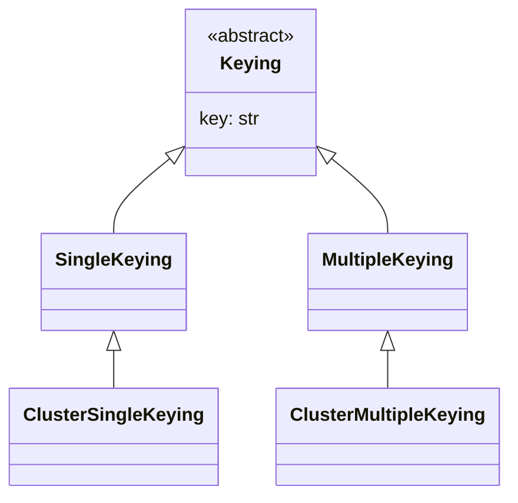
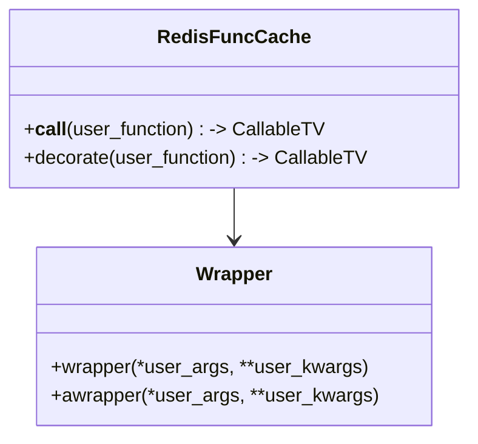
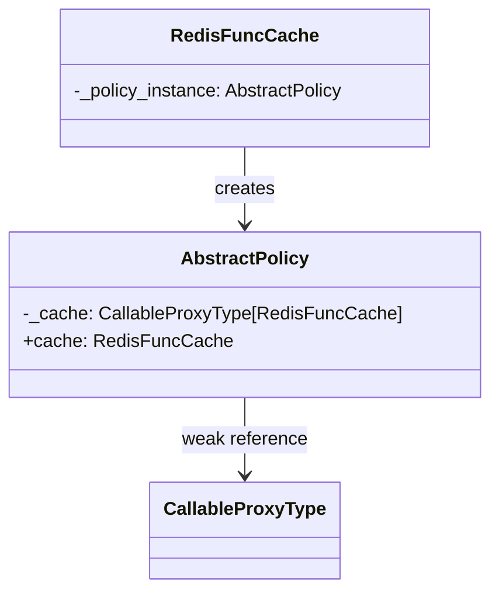

# redis_func_cache

[](https://github.com/tanbro/redis_func_cache/actions/workflows/python-package.yml)
[](https://codecov.io/gh/tanbro/redis_func_cache)
[](https://redis-func-cache.readthedocs.io/)
[](https://pypi.org/project/redis_func_cache/)

> *A Python library that provides decorators for caching function results in Redis, supporting multiple serialization formats and caching strategies, as well as asynchronous operations.*

## Introduction

`redis_func_cache` is a Python library that provides decorators for caching function results in Redis, similar to the caching functionality offered by the standard library. Like the [`functools`](https://docs.python.org/library/functools.html) module, it includes useful decorators such as [`lru_cache`](https://docs.python.org/library/functools.html#functools.lru_cache), which are valuable for implementing memoization.

Unlike in-process caches such as the standard library's `functools.lru_cache` — which are private to a single Python process — this library uses [Redis][] as a **distributed cache backend**: a result computed once is shared by every process and machine behind your application, and survives restarts and deploys. Decorated functions keep their ordinary look and feel; the distributed part is handled by the library:

- **Shared across processes and hosts** — one cache for all workers, no per-process duplication.
- **[Redis][] Cluster support** — dedicated policies pin each cache's keys to one hash slot; cache atomically on a cluster out of the box.
- **Atomic operations** — every cache read/write is a single Lua script executed atomically by [Redis][], safe under high concurrency.
- **High availability** — the cache inherits the availability of your [Redis][] deployment (replication, Sentinel, ...): no new infrastructure to operate.
- **Multiple eviction policies** — LRU, FIFO, LFU, RR, ... (Refer to [Cache Replacement Policies on Wikipedia](https://wikipedia.org/wiki/Cache_replacement_policies) for more details.)

Here is a simple example:

1. First, start up a Redis server at 127.0.0.1:6379, e.g.:

   ```bash
   docker run -it --rm -p 6379:6379 redis:alpine
   ```

1. Then install the library in your Python environment:

   ```bash
   pip install redis_func_cache
   ```

1. Finally, run the following Python code:

   ```python
   import asyncio
   from time import time
   import redis.asyncio as aioredis
   from redis_func_cache import LruTPolicy, RedisFuncCache as Cache

    # Create a redis connection pool (simple example)
    pool = aioredis.ConnectionPool.from_url("redis://")
    # Preferred: provide a factory for production/concurrent use
    factory = lambda: aioredis.Redis.from_pool(pool)

    # Create an LRU cache. Note: policy must be an instance and we prefer a factory.
    cache = Cache(__name__, LruTPolicy, factory=factory)

    # Decorate a function to cache its result
    @cache
    async def a_slow_func():
        t = time()
        await asyncio.sleep(10)  # Sleep to simulate a slow operation
        return f"actual duration: {time() - t}"

    with asyncio.Runner() as runner:
        t = time()
        r = runner.run(a_slow_func())
        print(f"duration={time() - t}, {r=}")

        t = time()
        r = runner.run(a_slow_func())
        print(f"duration={time() - t}, {r=}")
   ```

The output should look like:

```
duration=10.117542743682861, r='1755924146.8998647 ... 1755924156.9133286'
duration=0.001995563507080078, r='1755924146.8998647 ... 1755924156.9133286'
```

We can see that the second call to `a_slow_func()` is served from the cache, which is much faster than the first call, and its result is same as the first call.

## Features

- Built on [redis-py][], the official Python client for [Redis][].
- Simple [decorator][] syntax supporting both **`async`** and common functions, **asynchronous** and synchronous I/O.
- Support [Redis][] **cluster**.
- Multiple caching policies: LRU, FIFO, LFU, RR ...
- Serialization formats: JSON, Pickle, Dill, MsgPack, YAML, BSON, CBOR, cloudpickle ...
- Optional **handler** extension around the four serialization boundaries — async-aware (`*_async` methods), settable per cache or per function, for patterns like offloading large values to object storage while Redis stores only a small reference.
- Per-item TTL (Redis ≥ 7.4).
- Maintenance operations: `vacuum` to clean expired entries, `purge` to drop all cache structures — both without blocking Redis.

## Installation

- Install from PyPI:

    ```bash
    pip install redis_func_cache[hiredis]
    ```

- Install from source in a editable / development mode:

    ```bash
    git clone https://github.com/tanbro/redis_func_cache.git
    cd redis_func_cache
    pip install --editable --group dev .
    ```

- Or install from Github directly:

    ```bash
    pip install git+https://github.com/tanbro/redis_func_cache.git@main
    ```

The library supports [hiredis](https://github.com/redis/hiredis) which is strongly **recommended**. Installing it can significantly improve performance. It is an optional dependency and can be installed by running: `pip install redis_func_cache[hiredis]`.

If [Pygments](https://pygments.org/) is installed, the library will automatically remove comments and empty lines from Lua scripts evaluated on the [Redis](https://redis.io/) server, which can slightly improve performance. *Pygments* is also an optional dependency and can be installed by running: `pip install redis_func_cache[pygments]`.

## Data structure

The library combines a pair of [Redis][] data structures to manage cache data:

- The first is a sorted set, which stores the hash values of the decorated function calls along with a score for each item.

    When the cache reaches its maximum size, the score is used to determine which item to evict.

- The second is a hash map, which stores the hash values of the function calls and their corresponding return values.

This can be visualized as follows:



The main idea of the eviction policy is that the cache keys are stored in a set, and the cache values are stored in a hash map. Eviction is performed by removing the lowest-scoring item from the set, and then deleting the corresponding field and value from the hash map.

Here is an example showing how the *LRU* cache's eviction policy works (maximum size is 3):



The [`RedisFuncCache`][] executes a decorated function with specified arguments and caches its result. Here's a breakdown of the steps:

1. **Initialize Scripts**: Retrieve two Lua script objects for cache hit and update from `policy.lua_scripts`.
1. **Calculate Keys and Hash**: Compute the cache keys using `policy.calc_keys`, compute the hash value using `policy.calc_hash`, and compute any additional arguments using `policy.calc_ext_args`.
1. **Attempt Cache Retrieval**: Attempt to retrieve a cached result. If a cache hit occurs, deserialize and return the cached result.
1. **Execute User Function**: If no cache hit occurs, execute the decorated function with the provided arguments and keyword arguments.
1. **Serialize Result and Cache**: Serialize the result of the user function and store it in Redis.
1. **Return Result**: Return the result of the decorated function.


```mermaid
flowchart TD
    A[Start] --> B[Initialize Scripts]
    B --> C{Scripts Valid?}
    C -->|Invalid| D[Raise RuntimeError]
    C -->|Valid| E[Calculate Keys and Hash]
    E --> F[Attempt Cache Retrieval]
    F --> G{Cache Hit?}
    G -->|Yes| H[Deserialize and Return Cached Result]
    G -->|No| I[Execute User Function]
    I --> J[Serialize Result]
    J --> K[Store in Cache]
    K --> L[Return User Function Result]
```

## Concurrency and atomicity

The library guarantees thread safety and concurrency security through the following design principles:

1. Redis Client Handling

   - The cache does not manage connections itself. It issues commands — single Lua script invocations — through the [redis-py][] client you supply, either directly or via a `factory`.
   - Client thread safety, event-loop affinity and connection lifecycle are **defined by redis-py, not by this library**. Consult the redis-py documentation for the client type you use. In short, at the time of writing:

     - The synchronous `redis.Redis` client issues each command through a thread-safe connection pool, so sharing one client (and its pool) across threads is safe.
     - `Pipeline` and `PubSub` objects keep per-object state and must not be shared across threads. This library never creates them, but your own code should be careful.
     - `redis.asyncio` clients are bound to the event loop that created them. Using one client or pool from a different event loop is undefined behavior — create one pool per event loop.
     - Connections must not be inherited across process forks; rebuild the pool in the child process.

   - Prefer the **factory and pool** pattern: the factory should return lightweight clients sharing one pre-configured connection pool (e.g. `redis.Redis.from_pool(pool)`). A factory that creates a brand-new pool per call leaks connections and defeats redis-py's server-side Lua script cache.
   - All cache operations (get, put) are executed via Lua scripts to ensure atomicity, preventing race conditions during concurrent access.

   Here is an example using `redis.ConnectionPool` to avoid conflicts when the cache accesses Redis:

   ```python
   import redis
   from redis_func_cache import RedisFuncCache, LruPolicy

   redis_pool = redis.ConnectionPool(...)  # Use a pool, not a single client
   factory = lambda: redis.from_pool(redis_pool)  # Use factory, not a static client

   cache = RedisFuncCache(__name__, LruPolicy, factory=factory)

   @cache
   def your_concurrent_func(...):
       ...
   ```

1. Function Execution Concurrency

   Both synchronous and asynchronous functions decorated by RedisFuncCache are executed as-is. Therefore, each function is responsible for its own thread, coroutine or process safety.
   The only concurrency risk lies in Redis I/O and operations. The cache will use a synchronous Redis client for synchronous functions and an asynchronous Redis client for asynchronous functions.
   As described above, you should provide an appropriate Redis client or factory to the cache in concurrent scenarios.

1. Contextual State Isolation

   The [ContextVar](https://docs.python.org/3/library/contextvars.html#contextvars.ContextVar) based `mode_context()` context manager and other cache control context managers ensure thread and coroutine isolation. Each thread or async task maintains its own independent state, preventing cross-context interference.

Atomicity is a key feature of this library. All cache operations (both read and write) are implemented using Redis Lua scripts, which are executed atomically by the Redis server. This means that each script runs in its entirety without being interrupted by other operations, ensuring data consistency even under high concurrent load.

Each cache policy implements two Lua scripts:

- A "get" script that attempts to retrieve a value from cache and updates access information
- A "put" script that adds or updates a value in cache and performs eviction if necessary

These scripts operate on the cache data structures (a sorted set for tracking items and a hash map for storing values) in a single atomic operation. This prevents race conditions that could occur if multiple Redis commands were issued separately.

For Redis Cluster deployments, it's important to note that atomicity is guaranteed only within a single key's hash slot. Since our implementation uses two keys (a sorted set and a hash map) for each cache instance, both keys are designed to belong to the same hash slot. The cluster policies automatically calculate key slots to ensure that all cache data for a single cache instance is always located on the same node in the cluster. This design guarantees that cache operations can be executed atomically within the cluster environment.

These designs enable safe operation in both multi-threaded and asynchronous environments while maintaining high-performance Redis I/O throughput. For best results, use the library with Redis 6.0 or newer to take advantage of native Lua script atomicity and advanced connection management features.

## Documentation

More documentation is available in the [`docs`](https://github.com/tanbro/redis_func_cache/tree/main/docs) directory (and rendered at [Read the Docs](https://redis-func-cache.readthedocs.io/)):

- [Quick Start](docs/usage/quickstart.md) — prerequisites, a first cached function, choosing an eviction policy
- [Advanced Usage](docs/usage/advanced-usage.md) — custom serializers, the handler extension, custom key formats and hash algorithms
- [Configuration](docs/usage/configuration.md) — cache size & TTL, per-item TTL, serialization, `excludes`, multiple key pairs, cluster policies, cache mode control
- [Important Considerations](docs/usage/considerations.md) — cache stampede risk, known issues and limitations
- [Migration Guide (v0.6 → v0.7)](docs/usage/migration.md)

## Getting Started

Prerequisites, a first cached function (sync and async), and how to choose an eviction policy.
See [docs/usage/quickstart.md](docs/usage/quickstart.md) for the quick start guide.

## Important Considerations

Before using this library, please be aware of the important considerations: the cache stampede risk and its mitigation strategies, plus other key limitations.
See [docs/considerations.md](docs/usage/considerations.md) for details.

## Configuration

Cache size & TTL, per-item TTL, serialization, handling non-serializable arguments, multiple key pairs, Redis cluster policies, and cache mode control.
See [docs/configuration.md](docs/usage/configuration.md) for details.

## Migration Guide (v0.6 → v0.7)

v0.7 introduced breaking changes to the `RedisFuncCache` constructor.
See [docs/migration.md](docs/usage/migration.md) for the summary and migration examples.

## Advanced Usage

Custom serializers, the handler extension for the serialization boundaries, custom key formats, and custom hash algorithms (including the `make_hash_mixin` / `make_scripts_mixin` factories).
See [docs/advanced-usage.md](docs/usage/advanced-usage.md) for details.

## Cache Maintenance

Two explicit maintenance operations are available on both [`RedisFuncCache`][] and its policy (`cache.policy.vacuum` / `cache.policy.purge`):

### Vacuum: clean expired entries

With a per-item `ttl` (Redis ≥ 7.4), an expired result disappears from the HASH while its entry in the ZSET lingers as a "ghost" — an eviction slot that points to nothing. `vacuum` scans the sorted set in batches and removes those members:

```python
removed = cache.vacuum()  # async: removed = await cache.avacuum()
print(f"reclaimed {removed} expired entries")
```

- `vacuum(batch_size=500)` returns the number of ghost entries removed; `avacuum()` is the async mirror.
- It never blocks Redis: each batch is one atomic Lua script performing a single `ZSCAN` step, `HEXISTS` probes and a `ZREM`.
- For details on when ghosts appear and why this design was chosen, see [the design note](docs/design/field-ttl-vacuum.md).

### Purge: drop cache structures

`purge` deletes every Redis key the cache owns and returns the number of keys deleted:

```python
n = cache.purge()  # async: await cache.apurge()
print(f"deleted {n} keys")
```

- For "multiple" policies — one key pair per decorated function — the keys are enumerated with `SCAN` (never the blocking `KEYS`) and deleted in batches of `batch_size` (default 500) with `UNLINK`, so a large purge never stalls the server.
- For "single" policies, the static key pair is deleted with one command.
## Known Issues

See [docs/considerations.md](docs/usage/considerations.md#known-issues) for the full list of known issues and limitations.

## Test

1. Start a Redis server
1. Set up `REDIS_URL` environment variable (Default to `redis://` if not defined) to point to the Redis server.
1. Run the tests:

   ```bash
   uv run --all-extras pytest --cov
   ```

A Docker Compose file for unit testing is provided in the `docker` directory to simplify the process. You can run it by executing:

```bash
cd docker
docker compose run --rm unittest
```

It starts the Redis standalone server and cluster automatically (waits until healthy), runs lint, static checks and pytest against Python 3.10–3.14, and propagates the exit code.

The test container uses `uv run --frozen`, which installs dependencies strictly from `uv.lock` and never updates it. Note that `uv.lock` is **not** tracked in SCM (`*.lock` is gitignored), so:

- On a fresh checkout without `uv.lock`, the test script generates it once automatically before running.
- If you change dependencies in `pyproject.toml`, regenerate the lock yourself, otherwise the container keeps testing against the outdated resolution:

  ```bash
  uv lock
  ```

The container mounts named volumes for the uv download cache and the per-version virtual environments (`/venvs`), so repeated runs only do incremental installs. To force a full rebuild, remove them with `docker compose down -v`.

## Develop

Clone the project and enter the project directory:

```bash
git clone https://github.com/tanbro/redis_func_cache.git
cd redis_func_cache
```

We can use either the traditional method (`venv` and `pip`) of standard library or [uv][] as the environment manager.

- If using the traditional method, a virtual environment is recommended:

  1. Install a Python development environment on your system. The minimum required Python version is 3.10.

  1. Initialize a virtual environment at sub-directory `.venv`, then activate it:

     - On Unix-like systems:

        ```bash
        python -m venv .venv
        source .venv/bin/activate
        ```

        > 💡 **Tip:** \
        > On some older systems, `python` may be a symbolic link to `python2`. In such cases, you can use `python3` instead.

     - On Windows:

        ```powershell
        python -m venv .venv
        .venv\Scripts\Activate
        ```

        > 💡 **Tip:** \
        > On Windows, the command-line executable for Python may be either `python`, `python3` or `py`, depending on your installation method.

  1. Install the project with all extras and its development group dependencies:

     ```bash
     pip install -e[all] . --group dev
     ```

- If using [uv][], just the project with all extras and its development group dependencies:

  ```bash
  uv sync --all-groups --dev
  ```

  A Python virtual environment is created in the `.venv` directory by [uv][] automatically.

We suggest installing [pre-commit][] hooks:

```bash
pre-commit install
```

> ℹ️ **Note:** \
> Ensure that you have a stable internet connection during the installation process to avoid interruptions.

### Module structure


```mermaid
graph LR
    RedisFuncCache --> Policy
    RedisFuncCache --> Serializer
    RedisFuncCache --> ScriptExecution
    Policy --> Keying
    Policy --> Hasher
    Policy --> Scripts
    Keying --> SingleKeying
    Keying --> MultipleKeying
    SingleKeying --> ClusterSingleKeying
    MultipleKeying --> ClusterMultipleKeying
    Scripts --> LruScripts
    Scripts --> LruTScripts
    Scripts --> FifoScripts
    Scripts --> FifoTScripts
    Scripts --> LfuScripts
    Scripts --> MruScripts
    Scripts --> RrScripts
    LruScripts --> lru_get.lua
    LruScripts --> lru_put.lua
    LruTScripts --> lru_t_get.lua
    LruTScripts --> lru_t_put.lua
    Serializer --> json
    Serializer --> pickle
    Serializer --> dill
    Serializer --> msgpack
    Serializer --> bson
    Serializer --> yaml
    Serializer --> cbor
    Serializer --> cloudpickle
    ScriptExecution --> redis.commands.core.Script
    ScriptExecution --> redis.commands.core.AsyncScript
    RedisFuncCache --> utils.py
    utils.py --> b64digest
    utils.py --> get_callable_bytecode
```

### Class Diagrams

Core class:


```mermaid
classDiagram
    class RedisFuncCache {
        -redis_client: RedisClientTV
        -policy: AbstractPolicy
        -serializer: SerializerPairT
        +__init__(name, policy, redis_client, serializer)
        +__call__(func)
        +decorate(func)
        +exec(user_function, user_args, user_kwds)
        +aexec(user_function, user_args, user_kwds)
    }

    class Policy {
        +keying: Keying
        +hasher: Hasher
        +scripts: Scripts
        +calc_keys(f, args, kwds) -> Tuple[str, str]
        +calc_hash(f, args, kwds) -> KeyT
        +purge() -> int
        +apurge() -> int
        +get_size() -> int
        +vacuum() -> int
    }

    class Keying {
        <<interface>>
        key: str
        +calc_keys(prefix, name, f) -> Tuple[str, str]
    }

    class Hasher {
        <<interface>>
        __hash_config__: HashConfig
        +calc_hash(f, args, kwds) -> KeyT
    }

    class Scripts {
        <<interface>>
        get_script: str
        put_script: str
        +index_structure: str
    }

    RedisFuncCache --> Policy : uses
    Policy --> Keying
    Policy --> Hasher
    Policy --> Scripts
```

Composition of the three orthogonal dimensions (keying / hasher / scripts):


```mermaid
classDiagram
    class LruPolicy {
        Policy preset
    }

    class SingleKeying {
        key = "lru"
    }

    class LruScripts {
        get_script = "lru_get.lua"
        put_script = "lru_put.lua"
    }

    class PickleMd5Hasher {
        __hash_config__ = ...
    }

    LruPolicy --> SingleKeying
    LruPolicy --> LruScripts
    LruPolicy --> PickleMd5Hasher

    class FifoPolicy {
        Policy preset
    }

    class FifoScripts {
        get_script = "fifo_get.lua"
        put_script = "fifo_put.lua"
    }

    FifoPolicy --> SingleKeying
    FifoPolicy --> FifoScripts
    FifoPolicy --> PickleMd5Hasher
```

The four built-in keying variants:


```mermaid
classDiagram
    class Keying {
        <<abstract>>
        key: str
    }

    class SingleKeying
    class MultipleKeying
    class ClusterSingleKeying
    class ClusterMultipleKeying

    Keying <|-- SingleKeying
    Keying <|-- MultipleKeying
    SingleKeying <|-- ClusterSingleKeying
    MultipleKeying <|-- ClusterMultipleKeying
```

Decorator and proxy:


```mermaid
classDiagram
    class RedisFuncCache {
        +__call__(user_function) -> CallableTV
        +decorate(user_function) -> CallableTV
    }

    class Wrapper {
        +wrapper(*user_args, **user_kwargs)
        +awrapper(*user_args, **user_kwargs)
    }

    RedisFuncCache --> Wrapper
```

Weak reference:


```mermaid
classDiagram
    class AbstractPolicy {
        -_cache: CallableProxyType[RedisFuncCache]
        +cache: RedisFuncCache
    }

    class RedisFuncCache {
        -_policy_instance: AbstractPolicy
    }

    RedisFuncCache --> AbstractPolicy : creates
    AbstractPolicy --> CallableProxyType : weak reference
```

[redis]: https://redis.io/ "Redis is an in-memory data store used by millions of developers as a cache"
[redis-py]: https://redis.io/docs/develop/clients/redis-py/ "Connect your Python application to a Redis database"

[decorator]: https://docs.python.org/glossary.html#term-decorator "A function returning another function, usually applied as a function transformation using the @wrapper syntax"
[json]: https://www.json.org/ "JSON (JavaScript Object Notation) is a lightweight data-interchange format."
[`pickle`]: https://docs.python.org/library/pickle.html "The pickle module implements binary protocols for serializing and de-serializing a Python object structure."

[bson]: https://bsonspec.org/ "BSON, short for Bin­ary JSON, is a bin­ary-en­coded seri­al­iz­a­tion of JSON-like doc­u­ments."
[msgpack]: https://msgpack.org/ "MessagePack is an efficient binary serialization format."

[uv]: https://docs.astral.sh/uv/ "An extremely fast Python package and project manager, written in Rust."
[pre-commit]: https://pre-commit.com/ "A framework for managing and maintaining multi-language pre-commit hooks."

[`RedisFuncCache`]: redis_func_cache.cache.RedisFuncCache
[`Policy`]: redis_func_cache.policies.policy.Policy
[`SingleKeying`]: redis_func_cache.policies.keying.SingleKeying
[`Hasher`]: redis_func_cache.policies.hashing.Hasher

[`FifoPolicy`]: redis_func_cache.policies.fifo.FifoPolicy "First In First Out policy"
[`LfuPolicy`]: redis_func_cache.policies.lfu.LfuPolicy "Least Frequently Used policy"
[`LruPolicy`]: redis_func_cache.policies.lru.LruPolicy "Least Recently Used policy"
[`MruPolicy`]: redis_func_cache.policies.mru.MruPolicy "Most Recently Used policy"
[`RrPolicy`]: redis_func_cache.policies.rr.RrPolicy "Random Remove policy"
[`LruTPolicy`]: redis_func_cache.policies.lru.LruTPolicy "Time based Least Recently Used policy."

[`FifoMultiplePolicy`]: redis_func_cache.policies.fifo.FifoMultiplePolicy
[`LfuMultiplePolicy`]: redis_func_cache.policies.lfu.LfuMultiplePolicy
[`LruMultiplePolicy`]: redis_func_cache.policies.lru.LruMultiplePolicy
[`MruMultiplePolicy`]: redis_func_cache.policies.mru.MruMultiplePolicy
[`RrMultiplePolicy`]: redis_func_cache.policies.rr.RrMultiplePolicy
[`LruTMultiplePolicy`]: redis_func_cache.policies.lru.LruTMultiplePolicy

[`FifoClusterPolicy`]: redis_func_cache.policies.fifo.FifoClusterPolicy
[`LfuClusterPolicy`]: redis_func_cache.policies.lfu.LfuClusterPolicy
[`LruClusterPolicy`]: redis_func_cache.policies.lru.LruClusterPolicy
[`MruClusterPolicy`]: redis_func_cache.policies.mru.MruClusterPolicy
[`RrClusterPolicy`]: redis_func_cache.policies.rr.RrClusterPolicy
[`LruTClusterPolicy`]: redis_func_cache.policies.lru.LruTClusterPolicy

[`LruTClusterMultiplePolicy`]: redis_func_cache.policies.lru.LruTClusterMultiplePolicy
