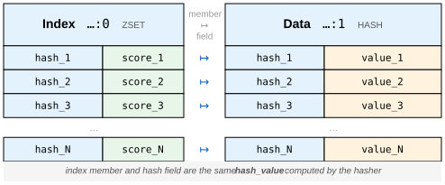
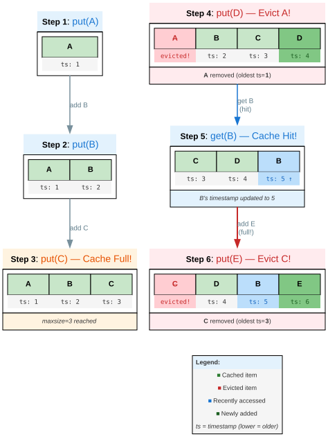
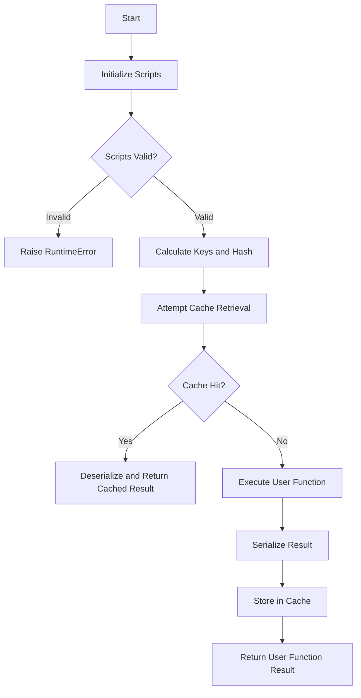

# redis_func_cache

[](https://github.com/tanbro/redis_func_cache/actions/workflows/python-package.yml)
[](https://codecov.io/gh/tanbro/redis_func_cache)
[](https://redis-func-cache.readthedocs.io/)
[](https://pypi.org/project/redis_func_cache/)

> _A Python library that provides decorators for caching function results in Redis, supporting multiple serialization formats and caching strategies, as well as asynchronous operations._

## Introduction

`redis_func_cache` is a Python library that provides decorators for caching function results in Redis, similar to the caching functionality offered by the standard library. Like the [`functools`](https://docs.python.org/library/functools.html) module, it includes useful decorators such as [`lru_cache`](https://docs.python.org/library/functools.html#functools.lru_cache), which are valuable for implementing memoization.

Unlike in-process caches such as the standard library's `functools.lru_cache` — which are private to a single Python process — this library uses [Redis][] as a **distributed cache backend**: a result computed once is shared by every process and machine behind your application, and survives restarts and deploys. Decorated functions keep their ordinary look and feel; the distributed part is handled by the library:

- **Shared across processes and hosts** — one cache for all workers, no per-process duplication.
- **[Redis][] Cluster support** — dedicated policies pin each cache's keys to one hash slot; cache atomically on a cluster out of the box.
- **Atomic operations** — every cache read/write is a single Lua script executed atomically by [Redis][], safe under high concurrency.
- **High availability** — the cache inherits the availability of your [Redis][] deployment (replication, Sentinel, ...): no new infrastructure to operate.
- **Multiple eviction policies** — LRU, FIFO, LFU, RR, ... (Refer to [Cache Replacement Policies on Wikipedia](https://wikipedia.org/wiki/Cache_replacement_policies) for more details.)

Here is a simple example:

1. First, start up a Redis server at 127.0.0.1:6379, e.g.:

   ```bash
   docker run -it --rm -p 6379:6379 redis:alpine
   ```

1. Then install the library in your Python environment:

   ```bash
   pip install redis_func_cache
   ```

1. Finally, run the following Python code:

   ```python
   import asyncio
   from time import time
   import redis.asyncio as aioredis
   from redis_func_cache import RedisFuncCache as Cache

    # Create a redis connection pool (simple example)
    pool = aioredis.ConnectionPool.from_url("redis://")
    # Preferred: provide a factory for production/concurrent use
    factory = lambda: aioredis.Redis.from_pool(pool)

    # Create a cache. The policy argument is omitted, so the default
    # lru_t_policy (time-based LRU) applies; presets are pre-composed
    # Policy instances, and we prefer a factory.
    cache = Cache(__name__, factory=factory)

    # Decorate a function to cache its result
    @cache
    async def a_slow_func():
        t = time()
        await asyncio.sleep(10)  # Sleep to simulate a slow operation
        return f"actual duration: {time() - t}"

    with asyncio.Runner() as runner:
        t = time()
        r = runner.run(a_slow_func())
        print(f"duration={time() - t}, {r=}")

        t = time()
        r = runner.run(a_slow_func())
        print(f"duration={time() - t}, {r=}")
   ```

The output should look like:

```
duration=10.117542743682861, r='1755924146.8998647 ... 1755924156.9133286'
duration=0.001995563507080078, r='1755924146.8998647 ... 1755924156.9133286'
```

We can see that the second call to `a_slow_func()` is served from the cache, which is much faster than the first call, and its result is same as the first call.

## Features

- Built on [redis-py][], the official Python client for [Redis][] — which is also the **only** runtime dependency (plus `typing-extensions` on Python < 3.12); the optional serialization formats are extras, and each is used only if its package is installed and selected.
- Simple [decorator][] syntax supporting both **`async`** and common functions, **asynchronous** and synchronous I/O.
- Support [Redis][] **Cluster**.
- Multiple caching policies: LRU, FIFO, LFU, RR ...
- Serialization formats: JSON, Pickle, Dill, MsgPack, YAML, BSON, CBOR, cloudpickle ...
- Optional **handler** extension around the four serialization boundaries — async-aware, settable per cache or per function, for patterns like offloading large values to object storage while Redis stores only a small reference.
- Per-item TTL (Redis ≥ 7.4).
- Maintenance operations: `vacuum` to clean expired entries, `purge` to drop all cache structures — both without blocking Redis.

## Installation

- Install from PyPI:

  ```bash
  pip install redis_func_cache[hiredis]
  ```

- Install from source in a editable / development mode:

  ```bash
  git clone https://github.com/tanbro/redis_func_cache.git
  cd redis_func_cache
  pip install --editable --group dev .
  ```

- Or install from Github directly:

  ```bash
  pip install git+https://github.com/tanbro/redis_func_cache.git@main
  ```

The library supports [hiredis](https://github.com/redis/hiredis) which is strongly **recommended**. Installing it can significantly improve performance. It is an optional dependency and can be installed by running: `pip install redis_func_cache[hiredis]`.

If [Pygments](https://pygments.org/) is installed, the library will automatically remove comments and empty lines from Lua scripts evaluated on the [Redis][] server, which can slightly improve performance. _Pygments_ is also an optional dependency and can be installed by running: `pip install redis_func_cache[pygments]`.

## Data structure

The library combines a pair of [Redis][] data structures to manage cache data:

- The first is a sorted set, which stores the hash values of the decorated function calls along with a score for each item.

  When the cache reaches its maximum size, the score is used to determine which item to evict.

- The second is a hash map, which stores the hash values of the function calls and their corresponding return values.

This can be visualized as follows:



The main idea of the eviction policy is that the cache keys are stored in a set, and the cache values are stored in a hash map. Eviction is performed by removing the lowest-scoring item from the set, and then deleting the corresponding field and value from the hash map.

Here is an example showing how the _LRU_ cache's eviction policy works (maximum size is 3):



The [`RedisFuncCache`][] executes a decorated function with specified arguments and caches its result. Here's a breakdown of the steps:

1. **Initialize Scripts**: Register the policy's two Lua scripts (cache hit and update) against the Redis client, cached per client.
1. **Locate the Call**: Compute the call identity — key pair and hash value — once via `policy.locate(prefix, name, ...)`; the same identity is shared by the handler context and the get/put script invocation. Any additional script arguments come from `policy.scripts.calc_ext_args`.
1. **Attempt Cache Retrieval**: Attempt to retrieve a cached result. If a cache hit occurs, deserialize and return the cached result.
1. **Execute User Function**: If no cache hit occurs, execute the decorated function with the provided arguments and keyword arguments.
1. **Serialize Result and Cache**: Serialize the result of the user function and store it in Redis.
1. **Return Result**: Return the result of the decorated function.


```mermaid
flowchart TD
    A[Start] --> B[Initialize Scripts]
    B --> C{Scripts Valid?}
    C -->|Invalid| D[Raise RuntimeError]
    C -->|Valid| E[Calculate Keys and Hash]
    E --> F[Attempt Cache Retrieval]
    F --> G{Cache Hit?}
    G -->|Yes| H[Deserialize and Return Cached Result]
    G -->|No| I[Execute User Function]
    I --> J[Serialize Result]
    J --> K[Store in Cache]
    K --> L[Return User Function Result]
```

## Concurrency and atomicity

The library guarantees thread safety and concurrency security through the following design principles:

1. Redis Client Handling

   - The cache does not manage connections itself. It issues commands — single Lua script invocations — through the [redis-py][] client you supply, either directly or via a `factory`.
   - Client thread safety, event-loop affinity and connection lifecycle are **defined by redis-py, not by this library**. Consult the redis-py documentation for the client type you use. In short, at the time of writing:

     - The synchronous `redis.Redis` client issues each command through a thread-safe connection pool, so sharing one client (and its pool) across threads is safe.
     - `Pipeline` and `PubSub` objects keep per-object state and must not be shared across threads. This library never creates them, but your own code should be careful.
     - `redis.asyncio` clients are bound to the event loop that created them. Using one client or pool from a different event loop is undefined behavior — create one pool per event loop.
     - Connections must not be inherited across process forks; rebuild the pool in the child process.

   - Prefer the **factory and pool** pattern: the factory should return lightweight clients sharing one pre-configured connection pool (e.g. `redis.Redis.from_pool(pool)`). A factory that creates a brand-new pool per call leaks connections and defeats redis-py's server-side Lua script cache.
   - All cache operations (get, put) are executed via Lua scripts to ensure atomicity, preventing race conditions during concurrent access.

   Here is an example using `redis.ConnectionPool` to avoid conflicts when the cache accesses Redis:

   ```python
   import redis
   from redis_func_cache import RedisFuncCache, lru_policy

   redis_pool = redis.ConnectionPool(...)  # Use a pool, not a single client
   factory = lambda: redis.from_pool(redis_pool)  # Use factory, not a static client

   cache = RedisFuncCache(__name__, lru_policy, factory=factory)

   @cache
   def your_concurrent_func(...):
       ...
   ```

1. Function Execution Concurrency

   Both synchronous and asynchronous functions decorated by RedisFuncCache are executed as-is. Therefore, each function is responsible for its own thread, coroutine or process safety.
   The only concurrency risk lies in Redis I/O and operations. The cache will use a synchronous Redis client for synchronous functions and an asynchronous Redis client for asynchronous functions.
   As described above, you should provide an appropriate Redis client or factory to the cache in concurrent scenarios.

1. Contextual State Isolation

   The [ContextVar](https://docs.python.org/3/library/contextvars.html#contextvars.ContextVar) based `mode_context()` context manager and other cache control context managers ensure thread and coroutine isolation. Each thread or async task maintains its own independent state, preventing cross-context interference.

Atomicity is a key feature of this library. All cache operations (both read and write) are implemented using Redis Lua scripts, which are executed atomically by the Redis server. This means that each script runs in its entirety without being interrupted by other operations, ensuring data consistency even under high concurrent load.

Each cache policy implements two Lua scripts:

- A "get" script that attempts to retrieve a value from cache and updates access information
- A "put" script that adds or updates a value in cache and performs eviction if necessary

These scripts operate on the cache data structures (a sorted set for tracking items and a hash map for storing values) in a single atomic operation. This prevents race conditions that could occur if multiple Redis commands were issued separately.

For Redis Cluster deployments, it's important to note that atomicity is guaranteed only within a single key's hash slot. Since our implementation uses two keys (a sorted set and a hash map) for each cache instance, both keys are designed to belong to the same hash slot. The cluster policies automatically calculate key slots to ensure that all cache data for a single cache instance is always located on the same node in the cluster. This design guarantees that cache operations can be executed atomically within the cluster environment.

These designs enable safe operation in both multi-threaded and asynchronous environments while maintaining high-performance Redis I/O throughput. For best results, use the library with Redis 6.0 or newer to take advantage of native Lua script atomicity and advanced connection management features.

## Documentation

More documentation is available in the [`docs`](https://github.com/tanbro/redis_func_cache/tree/main/docs) directory (and rendered at [Read the Docs](https://redis-func-cache.readthedocs.io/)):

- [Quick Start](docs/usage/quickstart.md) — prerequisites, a first cached function, choosing an eviction policy
- [Advanced Usage](docs/usage/advanced-usage.md) — custom serializers, the handler extension, custom key formats and hash algorithms
- [Configuration](docs/usage/configuration.md) — cache size & TTL, per-item TTL, serialization, `excludes`, multiple key pairs, cluster policies, cache mode control
- [Important Considerations](docs/usage/considerations.md) — cache stampede risk, known issues and limitations
- [Migration Guide](docs/usage/migration.md) — 0.x → 1.0 breaking changes and migration

## Cache Maintenance

Two explicit maintenance operations are available on both [`RedisFuncCache`][] (`cache.vacuum` / `cache.purge`) and its policy (`policy.vacuum_all_pairs(redis_client, prefix, name)` / `policy.purge_all_pairs(redis_client, prefix, name)`):

### Vacuum: clean expired entries

With a per-item `ttl` (Redis ≥ 7.4), an expired result disappears from the HASH while its entry in the ZSET lingers as a "ghost" — an eviction slot that points to nothing. `vacuum` scans the sorted set in batches and removes those members:

```python
removed = cache.vacuum()  # async: removed = await cache.avacuum()
print(f"reclaimed {removed} expired entries")
```

- `vacuum(batch_size=500)` returns the number of ghost entries removed; `avacuum()` is the async mirror.
- It never blocks Redis: each batch is one atomic Lua script performing a single `ZSCAN` step, `HEXISTS` probes and a `ZREM`.
- For details on when ghosts appear and why this design was chosen, see [the design note](docs/design/field-ttl-vacuum.md).

### Purge: drop cache structures

`purge` deletes every Redis key the cache owns and returns the number of keys deleted:

```python
n = cache.purge()  # async: await cache.apurge()
print(f"deleted {n} keys")
```

- For "multiple" policies — one key pair per decorated function — the keys are enumerated with `SCAN` (never the blocking `KEYS`) and deleted in batches of `batch_size` (default 500) with `UNLINK`, so a large purge never stalls the server.
- For "single" policies, the static key pair is deleted with one command.

## Known Issues

See [docs/considerations.md](docs/usage/considerations.md#known-issues) for the full list of known issues and limitations.

## Test

Start a Redis server, then run the test suite (a Docker Compose file in the `docker` directory can start Redis and run the whole suite for you). Detailed instructions — environment variables, the cluster test groups, and the Docker-based runner — are in [CONTRIBUTING.md](CONTRIBUTING.md#running-tests).

## Develop

To set up a development environment, clone the repository and see [CONTRIBUTING.md](CONTRIBUTING.md#development-setup) for the full setup (virtual environment, dependencies, [pre-commit][] hooks — some of which invoke host tools such as Node.js and `lua-language-server` — plus coding conventions and the architecture overview).

## Architecture

The library composes three orthogonal components into an eviction policy: **Keying** (key naming, with cluster hash-tag variants), **Hasher** (per-call sub-key computation) and **Scripts** (the Lua script declarations). Full module structure and class diagrams are documented in [CONTRIBUTING.md](CONTRIBUTING.md#architecture).

[redis]: https://redis.io/ "Redis is an in-memory data store used by millions of developers as a cache"
[redis-py]: https://redis.io/docs/develop/clients/redis-py/ "Connect your Python application to a Redis database"
[decorator]: https://docs.python.org/glossary.html#term-decorator "A function returning another function, usually applied as a function transformation using the @wrapper syntax"
[pre-commit]: https://pre-commit.com/ "A framework for managing and maintaining multi-language pre-commit hooks."
[`RedisFuncCache`]: redis_func_cache.cache.RedisFuncCache
