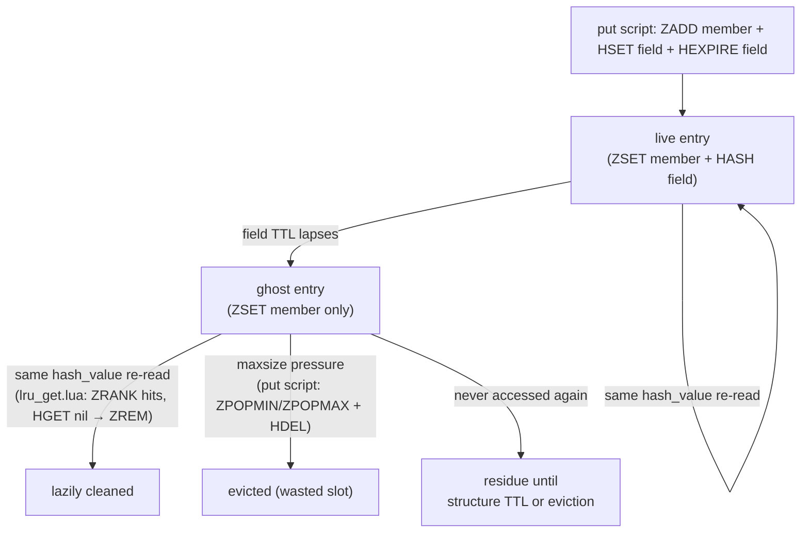

# Design Note: Vacuuming Expired Per-Field Cache Entries

## Background

Every cache maintained by *redis-func-cache* consists of **two Redis keys**:

- `...:0` — a **sorted set (ZSET)** holding one member per cached invocation (the
  `hash_value`), scored according to the eviction policy (last-access timestamp for
  LRU/LRU-T, insertion order for FIFO, access frequency for LFU, …);
- `...:1` — a **hash (HASH)** mapping the same `hash_value` to the serialized return
  value.

All reads and writes go through policy-specific Lua scripts so that both structures are
updated atomically.

Since v0.5, the `decorate` method accepts an experimental `ttl` parameter (**field
TTL**, not to be confused with the structure-level `ttl` of `RedisFuncCache`). When
set, the put script calls
[`HEXPIRE`](https://redis.io/docs/latest/commands/hexpire/) (Redis ≥ 7.4) so that an
individual cached result expires on its own schedule:

```lua
-- src/redis_func_cache/lua/*_put.lua (both the update and the insert branch)
if tonumber(field_ttl) > 0 then
    redis.call('HEXPIRE', hmap_key, field_ttl, 'FIELDS', 1, hash)
end
```

`HEXPIRE` deletes the **hash field** when it lapses. It knows nothing about the ZSET.

## The ghost-entry problem

When a field expires, its ZSET member survives as a *ghost*: an eviction slot that
points to a value that is no longer there. The full lifecycle:



Two cleanup paths already exist, both *incidental*:

1. **Lazy cleanup on re-access.** The get scripts handle the mismatch case: when
   `ZRANK` finds the member but `HGET` returns nothing, the member is removed
   (`ZREM`). This only triggers for the *same* `hash_value`, i.e. the same function
   called again with the same arguments.
2. **Incidental eviction.** Ghosts occupy eviction slots, so under `maxsize` pressure
   they are eventually popped from the ZSET and `HDEL`ed (a no-op for missing fields).

The residue case is real for functions whose argument sets diverge — each distinct call
creates a new `hash_value`, and old ones whose fields expired are typically never
re-read. Their ghosts sit in the ZSET until the structure-level TTL expires the whole
key, or until eviction reclaims the slot.

### Severity: an accuracy problem, not a leak

`maxsize` is always positive, so the ZSET is bounded and ghosts cannot grow without
limit — memory is bounded by the same envelope as live entries. The actual costs are
**accuracy and efficiency**:

- `get_size` reports `HLEN` (live entries), while eviction decisions and the eviction
  script use `ZCARD` (live + ghosts). The two numbers diverge as ghosts accumulate.
- Every ghost wastes one eviction slot: reclaiming it costs a full
  `ZPOPMIN`/`ZPOPMAX` + `HDEL` cycle that evicts no real entry.

## Options considered

| Option | Verdict | Why |
| --- | --- | --- |
| Explicit `vacuum()` / `avacuum()` on the policy | **Adopted** | Deterministic, O(1) extra cost on the hot path, accurate reporting. See below. |
| Whole vacuum as a single atomic Lua script (cursor loop server-side) | Rejected | Redis executes scripts on its single thread; a full ZSET traversal inside one script blocks the entire instance for the duration and can hit the busy-reply threshold on large caches. Chunked execution exists precisely to yield. |
| Probabilistic sampling embedded in the put script (`ZRANDMEMBER` + `HEXISTS` + `ZREM`) | **Rejected** | Nondeterministic: cleanup latency is unbounded (a ghost may linger arbitrarily long), the hot-path cost fluctuates with traffic, and the eventual size still cannot be trusted at any point in time. It optimizes the wrong property — we want *accurate* size and *bounded* residue, not expected-value cleanup. |
| Score-range targeted sweep (`ZRANGEBYSCORE` on "old" members) | Rejected | `field_ttl` is per-decorated-function while `HEXPIRE` is refreshed only on put; last-access scores and field expiry times diverge. Worse, score semantics differ per policy (timestamp / insertion order / frequency), so the sweep would have to be policy-specific. |
| Native enumeration of expired fields | Rejected | Redis exposes no API to list expired-but-unreclaimed fields. The closest probe, `HTTL`, is per-field — it cannot drive an enumeration, only confirm a guess. |
| Keyspace notifications + background sweeper thread | Rejected | Expired-field notifications for hashes are not delivered reliably (and hash-field expiry events are emitted on access, not on expiry); it also drags a runtime dependency and threading model into the library. |
| Versioned/generation keys (swap structure on invalidation) | Rejected | A wholesale redesign of the key layout to solve a bounded, low-severity issue. |

## Chosen design: `vacuum` on the policy

The chosen design is an **explicit, on-demand maintenance operation**, placed on
`AbstractPolicy` and delegated by `RedisFuncCache`:

```python
from redis import Redis
from redis_func_cache import LruPolicy, RedisFuncCache

cache = RedisFuncCache("my-cache", LruPolicy(), factory=lambda: Redis.from_url("redis://"))


@cache.decorate(ttl=600)  # per-item TTL (Redis >= 7.4)
def fetch_user_profile(user_id: str):
    ...


removed = cache.vacuum()  # or: await cache.avacuum()
print(f"removed {removed} expired entries")
```

- `cache.vacuum(batch_size=500)` removes every ZSET member whose hash field has
  expired and returns the number removed. `cache.avacuum()` is the async mirror.
- It is also available directly on the policy: `cache.policy.vacuum()`.
- It raises `RuntimeError` when called against a client whose sync/async nature does
  not match the call, mirroring `purge` / `apurge`.

### Why the policy level is the right home

The algorithm is **policy-independent by construction**: it only ever asks "does this
ZSET member still have a hash field?", and never interprets scores. One shared
implementation covers all six policy families (single/multiple × plain/cluster, across
FIFO/LFU/LRU/LRU-T/MRU/RR), and the operation is cluster-safe because it touches a
single key pair per script invocation (both keys of a pair share a hash tag in the
cluster policies).

One structural wrinkle: multiple policies derive a key pair *per decorated function*,
so a vacuum call has no function argument to compute keys from. The enumeration of key
pairs is therefore a small hook implemented once each in `BaseSinglePolicy` (return the
static pair) and `BaseMultiplePolicy` (enumerate pairs by a `SCAN` pattern, deriving
the hash key from each sorted-set key's `:0` suffix). This is the single-versus-multiple
*structural* distinction, not eviction logic — the six eviction strategies themselves
remain zero-code.

### Implementation shape: a cursor-passing Lua script

The decision chain has a read-after-check dependency: the `HEXISTS` results determine
which members to `ZREM`. Splitting the work between client and server (client-side
`ZSCAN`, then a script call with the member batch) would cost **two round trips per
chunk** and leave a **non-atomic gap** between probe and removal: if a concurrent put
revives a ghost in that gap, the vacuum would delete the revived member and create the
*inverse* ghost — a live hash field with no ZSET member. The get/put scripts'
half-existence recovery would eventually repair it, but the library should not
manufacture dirty state in the first place.

The unit of atomicity is therefore the **per-chunk Lua script**, which also drives the
scan:

1. Client → script: pass the key pair in `KEYS`, the previous cursor and the scan
   `COUNT` hint in `ARGV`;
2. the script performs **one** `ZSCAN` step, `HEXISTS`-probes every fetched member,
   removes the dead ones with a single `ZREM`, and **returns the next cursor plus the
   number of removed ghosts**;
3. the client accumulates the counts and calls again until the cursor returns to `0`.

This shape buys three properties at once:

- **One round trip per chunk.** The scan and the removal travel together; the client
  never fetches members it cannot act on immediately.
- **No inverse-ghost window.** Scan, probe and removal are atomic within one script
  invocation: a revival either happens before the script (the probe sees the live
  field and skips the member) or after it (the next vacuum run sees it). Each call
  touches at most `COUNT` members and then yields, so the single-threaded server stays
  responsive — the reason a *whole-vacuum* script with a server-side cursor loop was
  rejected (see the options table).
- **Reuse of the script infrastructure.** The script travels through the same
  `read_lua_file` / `clean_lua_script` / `client.register_script` pipeline as the six
  pairs of policy scripts, and its return value is the chunk result — no extra
  plumbing.

Enumeration of *which* key pairs to vacuum stays client-side (`SCAN MATCH` on the
library-owned pattern): a script may only touch keys sharing one cluster slot, while
multiple policies spread their pairs across slots — so no script can enumerate and
touch all pairs in a cluster. The client-side enumeration also yields between pages,
and races against concurrent `purge`/expiry degrade to harmless no-ops on missing
keys; pairs created mid-run are picked up by the next vacuum.

The key-pair enumeration is exposed as a small **abstract** hook pair,
`calc_key_pairs` / `acalc_key_pairs`. Being mandatory override points, they are
`@abstractmethod` on `AbstractPolicy`, so a policy missing them fails at instantiation
rather than mid-vacuum. The rule of thumb: **hooks that subclasses must implement are
abstract and public; machinery that subclasses must not touch carries a leading
underscore** — consistent with `calc_keys` / `purge` / `get_size` conventions in the
same hierarchy.

### Relationship to `get_size`

A natural companion refinement is `get_size(accurate: bool = False)`: when `True`,
vacuum first and then report `HLEN` (== `ZCARD` at that moment). This is a possible
follow-up, not part of the initial change.
