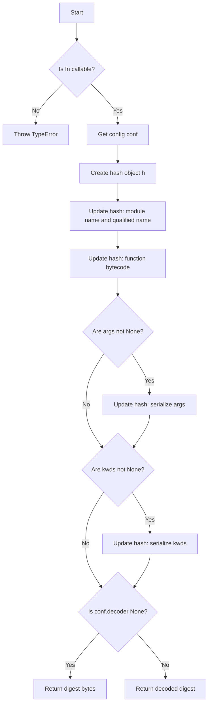

# Advanced Usage

## Custom Serializer

The result of the decorated function is serialized by default using [JSON][] (via the json module from the standard library) and then saved to [Redis][].

To utilize alternative serialization methods, such as [msgpack][], you have two options:

1. Specify the `serializer` argument in the constructor of [`RedisFuncCache`][], where the argument is a tuple of `(serializer, deserializer)`, or the name of the serializer function:

   This method applies globally: all functions decorated by this cache will use the specified serializer.

   For example:

   ```python
   import bson
   from redis import Redis
   from redis_func_cache import RedisFuncCache, LruTPolicy


   def serialize(x):
       return bson.encode({"return_value": x})


   def deserialize(x):
       return bson.decode(x)["return_value"]


   cache = RedisFuncCache(
       __name__, LruTPolicy(), factory=lambda: Redis.from_url("redis://"), serializer=(serialize, deserialize)
   )


   @cache
   def func(): ...
   ```

1. Specify the `serializer` argument directly in the decorator. The argument should be a tuple of (`serializer`, `deserializer`) or simply the name of the serializer function.

   This method applies on a per-function basis: only the decorated function will use the specified serializer.

   For example:

   - We can use [msgpack][] as the serializer to cache functions whose return value is binary data, which is not possible with [JSON][].
   - We can use [bson][] as the serializer to cache functions whose return value is a `datetime` object, which cannot be handled by either [JSON][] or [msgpack][].

   ```python
   import msgpack
   from redis import Redis
   from redis_func_cache import RedisFuncCache, LruTPolicy

   cache = RedisFuncCache(__name__, LruTPolicy(), factory=lambda: Redis.from_url("redis://"))


   @cache(serializer=(msgpack.packb, msgpack.unpackb))
   def create_or_get_token(user: str) -> bytes:
       from secrets import token_bytes

       return token_bytes(32)


   @cache(serializer="bson")
   def now_time():
       from datetime import datetime

       return datetime.now()
   ```

## Handler: Extending the Serialization Boundaries

When `serializer` is not enough — you need **async I/O**, **per-invocation context**, or the ability to **take over only one direction** while keeping the library's default on the other — pass a `handler` to the cache constructor.

A handler wraps four boundaries. `HandlerProtocol` is a pure structural protocol — implementations need not inherit from it; matching its signatures is the contract, checked statically. The eight methods form two groups (sync and `*_async`): implement at least the group your execution path uses — both if you serve both — and keep the other group as `raise NotImplementedError` placeholders if unused. Within an implemented group every method is defined: boundaries you don't use return their input unchanged and unhandled — `before_*`: `(False, value)`, `after_*`: the value:

| Boundary | Sync | Async |
| --- | --- | --- |
| Write, before library serializes | `before_serialize` | `before_serialize_async` |
| Write, after library serializes | `after_serialize` | `after_serialize_async` |
| Read, before library deserializes | `before_deserialize` | `before_deserialize_async` |
| Read, after library deserializes | `after_deserialize` | `after_deserialize_async` |

**When to use which:**

- Encoding format only (JSON, msgpack, …) or a sync custom encoding → use [`serializer`][].
- Async I/O, call context (`keys` / `args` / `func`), or taking over part of the library's own steps → use `handler`.
- The two combine: `serializer` defines the default encoding; `handler` may replace bytes at any boundary.

### Handler context

Every handler method receives the value plus an immutable `HandlerContext` as a keyword-only argument:

```python
@dataclass(frozen=True)
class HandlerContext:
    keys: tuple[KeyT, KeyT]  # (zset_key, hash_key) for this cache entry
    hash_value: KeyT         # hash field for this invocation
    func: Callable | None    # the decorated function
    args: tuple              # effective positional arguments
    kwds: dict               # effective keyword arguments
```

`args` / `kwds` are the **effective** arguments — the same excludes-filtered arguments used to compute the cache keys — so references a handler builds from them stay consistent with cache identity.

### Return conventions

- `before_serialize` / `before_deserialize` return `(handled, value)`. The `value` **always** replaces the working value; `handled` decides whether the library still runs its own serialize/deserialize step. When `handled=True`, the handler owns everything after that boundary: the library performs **no** further processing on that side, including the corresponding `after_*` method:
  - `before_serialize`, `handled=True`: skip the library serializer **and** `after_serialize` — `value` must already be bytes and is written to Redis as-is.
  - `before_deserialize`, `handled=True`: `value` is the final result — skip the library deserializer **and** `after_deserialize`.
- `after_serialize` / `after_deserialize` return the replacement value directly (not a tuple); there is no default library step left after them to skip.
- A boundary you don't use still returns explicitly and identically: `before_*` → `(False, value)` (unhandled, value unchanged — the library's default step runs), `after_*` → the value unchanged.

Sync methods must not be coroutine functions; `*_async` methods must be. The asynchronous path calls **only** the `*_async` methods — there is **no** async-to-sync fallback — so an async cache requires the `*_async` group; a sync-only handler keeps that group as `raise NotImplementedError` placeholders. This guarantees that blocking synchronous I/O can never be introduced onto the event loop implicitly.

A handler may be set at cache level (constructor `handler=`) or per decorated function (`decorate(handler=...)`); the per-function value wins when given.

### Example: offload large values to object storage

The offload logic lives in the two `before_*` methods; the two `after_*` methods are identity functions, through which the library's own values pass unchanged:

```python
from redis_func_cache import HandlerContext, LruTPolicy, RedisFuncCache

LARGE = 1 << 20  # 1 MiB


class ObjectStorageOffload:
    """Store big payloads in object storage; Redis keeps only a reference."""

    def before_serialize(self, value, *, ctx: HandlerContext):
        payload = encode(value)  # your encoding, e.g. msgpack / HTML bytes
        if len(payload) <= LARGE:
            return False, value  # small: library serializes as usual
        ref = object_store.put(payload, ctx.args)  # async app: also define the *_async methods
        return True, encode_ref(ref)  # large: write only the reference bytes

    def before_deserialize(self, data, *, ctx: HandlerContext):
        if not is_ref(data):
            return False, data  # small: library deserializes as usual
        payload = object_store.get(decode_ref(data))
        return True, decode(payload)  # reference: resolve to the final value

    def after_serialize(self, data, *, ctx: HandlerContext):
        return data  # nothing to post-process: store the library's bytes as-is

    def after_deserialize(self, value, *, ctx: HandlerContext):
        return value  # nothing to post-process: return the library's value as-is


cache = RedisFuncCache(
    __name__,
    LruTPolicy(),
    factory=lambda: Redis.from_url("redis://"),
    handler=ObjectStorageOffload(),
)

# Or override per decorated function:
@cache.decorate(handler=OtherHandler())
def other_func(...): ...
```

The library never learns about object storage: it sees a small value on write and a final value on read. Exceptions raised by a handler propagate to the caller — the library provides no retry, fallback, or error counting; reliability belongs entirely to the handler. See the design note [`docs/design/handler.md`](../design/handler.md) for the full specification, including mode interaction and non-goals.

## Custom key format

An instance of [`RedisFuncCache`][] calculates key pair names by calling the `calc_keys` method of its policy.
There are four basic policies that implement respective kinds of key formats:

- [`BaseSinglePolicy`][]: All functions share the same key pair, [Redis][] cluster is NOT supported.

    The format is: `<prefix><name>:<__key__>:<0|1>`

- [`BaseMultiplePolicy`][]: Each function has its own key pair, [Redis][] cluster is NOT supported.

    The format is: `<prefix><name>:<__key__>:<function_name>#<function_hash>:<0|1>`

- [`BaseClusterSinglePolicy`][]: All functions share the same key pair, [Redis][] cluster is supported.

    The format is: `<prefix>{<name>:<__key__>}:<0|1>`

- [`BaseClusterMultiplePolicy`][]: Each function has its own key pair, and [Redis][] cluster is supported.

    The format is: `<prefix><name>:<__key__>:<function_name>#{<function_hash>}:<0|1>`

Variables in the format string are defined as follows:

|                 |                                                                      |
| --------------- | -------------------------------------------------------------------- |
| `prefix`        | `prefix` argument of [`RedisFuncCache`][]                            |
| `name`          | `name` argument of [`RedisFuncCache`][]                              |
| `__key__`       | `__key__` attribute of the policy class used in [`RedisFuncCache`][] |
| `function_name` | full name of the decorated function                                  |
| `function_hash` | hash value of the decorated function                                 |

`0` and `1` at the end of the keys are used to distinguish between the two data structures:

- `0`: a sorted or unsorted set, used to store the hash value and sorting score of function invocations
- `1`: a hash table, used to store the return value of the function invocation

If you want to use a different format, you can subclass [`AbstractPolicy`][] or any of the above policy classes, and implement the `calc_keys` method, then pass the custom policy class to [`RedisFuncCache`][].

The following example demonstrates how to customize the key format for an *LRU* policy:

```python
from __future__ import annotations

from typing import TYPE_CHECKING, Any, Callable, Mapping, Sequence, Tuple, override

import redis
from redis_func_cache import RedisFuncCache
from redis_func_cache.policies.abstract import AbstractPolicy
from redis_func_cache.mixins.hash import PickleMd5HashMixin
from redis_func_cache.mixins.scripts import LruScriptsMixin

if TYPE_CHECKING:
    from redis.typing import KeyT


def factory():
    return redis.from_url("redis://")


MY_PREFIX = "my_prefix"


class MyPolicy(LruScriptsMixin, PickleMd5HashMixin, AbstractPolicy):
    __key__ = "my_key"

    @override
    def calc_keys(
        self, fn: Callable | None = None, args: Sequence | None = None, kwds: Mapping[str, Any] | None = None
    ) -> Tuple[KeyT, KeyT]:
        k = f"{self.cache.prefix}-{self.cache.name}-{fn.__name__}-{self.__key__}"
        return f"{k}-set", f"{k}-map"


my_cache = RedisFuncCache(name="my_cache", policy=MyPolicy(), factory=factory, prefix=MY_PREFIX)


@my_cache
def my_func(*args, **kwargs): ...
```

In the example, we'll get a cache that generates [Redis][] keys separated by `-`, instead of `:`, prefixed by `"my-prefix"`, and suffixed by `"set"` and `"map"`, rather than `"0"` and `"1"`. The key pair names could be like `my_prefix-my_cache_func-my_key-set` and `my_prefix-my_cache_func-my_key-map`.

`LruScriptsMixin` tells the policy which Lua script to use, and `PickleMd5HashMixin` tells the policy to use [`pickle`][] to serialize and `md5` to calculate the hash value of the function.

> ❗ **Important:**\
> The calculated key name **SHOULD** be unique for each [`RedisFuncCache`][] instance.
>
> [`BaseSinglePolicy`][], [`BaseMultiplePolicy`][], [`BaseClusterSinglePolicy`][], and [`BaseClusterMultiplePolicy`][] calculate their key names by calling the `calc_keys` method, which uses their `__key__` attribute and the `name` property of the [`RedisFuncCache`][] instance.
> If you subclass any of these classes, you should override the `__key__` attribute to ensure that the key names remain unique.

## Custom Hash Algorithm

When the library performs a get or put action with [Redis][], the hash value of the function invocation will be used.

For the sorted set data structures, the hash value will be used as the member. For the hash map data structure, the hash value will be used as the hash field.

The algorithm used to calculate the hash value is defined in `AbstractHashMixin`, and can be described as below:

```python
import hashlib


class AbstractHashMixin:
    __hash_config__ = ...

    ...

    def calc_hash(self, fn=None, args=None, kwds=None):
        if not callable(fn):
            raise TypeError(f"Cannot calculate hash for {fn=}")
        conf = self.__hash_config__
        h = hashlib.new(conf.algorithm)
        h.update(f"{fn.__module__}:{fn.__qualname__}".encode())
        h.update(fn.__code__.co_code)
        if args is not None:
            h.update(conf.serializer(args))
        if kwds is not None:
            h.update(conf.serializer(kwds))
        if conf.decoder is None:
            return h.digest()
        return conf.decoder(h)
```

As the code snippet above shows, the hash value is calculated by the full name of the function, the bytecode of the function, and the arguments and keyword arguments — they are serialized and hashed, then decoded.

The serializer and decoder are defined in the `__hash_config__` attribute of the policy class and are used to serialize arguments and decode the resulting hash. By default, the serializer is [`pickle`][] and the decoder uses the md5 algorithm. If no decoder is specified, the hash value is returned as bytes.

This configuration can be illustrated as follows:



If we want to use a different algorithm, we can select a mixin hash class defined in `src/redis_func_cache/mixins/hash.py`. For example:

- To serialize the function with [JSON][], use the SHA1 hash algorithm, store hex string in redis, you can choose the `JsonSha1HexHashMixin` class.
- To serialize the function with [`pickle`][], use the MD5 hash algorithm, store base64 string in redis, you can choose the `PickleMd5Base64HashMixin` class.

These mixin classes provide alternative hash algorithms and serializers, allowing for flexible customization of the hashing behavior. The following example shows how to use the `JsonSha1HexHashMixin` class:

```python
from redis import Redis
from redis_func_cache import RedisFuncCache
from redis_func_cache.policies.abstract import AbstractPolicy
from redis_func_cache.mixins.hash import JsonSha1HexHashMixin
from redis_func_cache.mixins.scripts import LruScriptsMixin


class MyLruPolicy(LruScriptsMixin, JsonSha1HexHashMixin, AbstractPolicy):
    __key__ = "my-lru"


my_json_sha1_hex_cache = RedisFuncCache(
    name="json_sha1_hex", policy=MyLruPolicy(), factory=lambda: Redis.from_url("redis://")
)
```

If none of the predefined combinations fits — for example, you want `msgpack` serialization with `sha3_256` — you can generate a mixin class with the [`make_hash_mixin`][redis_func_cache.mixins.hash.make_hash_mixin] factory instead of hand-writing one:

```python
import msgpack
from redis_func_cache.mixins.hash import HashConfig, make_hash_mixin

MsgpackSha3HashMixin = make_hash_mixin(
    "MsgpackSha3HashMixin",
    HashConfig(algorithm="sha3_256", serializer=msgpack.packb),
)
```

Note that each call to the factory returns a fresh class, so type checks should target `AbstractHashMixin` rather than a particular factory call's result. The same pattern exists for scripts mixins via [`make_scripts_mixin`][redis_func_cache.mixins.scripts.make_scripts_mixin].

```python
from redis_func_cache.mixins.scripts import make_scripts_mixin

MyScriptsMixin = make_scripts_mixin("MyScriptsMixin", ("my_get.lua", "my_put.lua"))
```


Or even write an entire new algorithm. For that, we subclass `AbstractHashMixin` and override the `calc_hash` method. For example:

```python
from __future__ import annotations

import hashlib
from typing import TYPE_CHECKING, override, Any, Callable, Mapping, Sequence
import cloudpickle
from redis import Redis
from redis_func_cache import RedisFuncCache
from redis_func_cache.policies.abstract import AbstractPolicy
from redis_func_cache.mixins.hash import AbstractHashMixin
from redis_func_cache.mixins.scripts import LruScriptsMixin

if TYPE_CHECKING:  # pragma: no cover
    from redis.typing import KeyT


class MyHashMixin(AbstractHashMixin):
    @override
    def calc_hash(
        self, fn: Callable | None = None, args: Sequence | None = None, kwds: Mapping[str, Any] | None = None
    ) -> KeyT:
        assert callable(fn)
        dig = hashlib("balck2b")
        dig.update(fn.__qualname__.encode())
        dig.update(cloudpickle.dumps(args))
        dig.update(cloudpickle.dumps(kwds))
        return dig.hexdigest()


class MyLruPolicy2(LruScriptsMixin, MyHashMixin, AbstractPolicy):
    __key__ = "my-lru2"


my_custom_hash_cache = RedisFuncCache(name=__name__, policy=MyLruPolicy2(), client=redis_client)

redis_client = Redis.from_url("redis://")


@my_custom_hash_cache
def some_func(*args, **kwargs): ...
```

> 💡 **Tip:**\
> The purpose of the hash algorithm is to ensure the isolation of cached return values for different function invocations.
> Therefore, you can generate unique key names using any method, not just hashes.

[redis]: https://redis.io/ "Redis is an in-memory data store used by millions of developers as a cache"
[redis-py]: https://redis.io/docs/develop/clients/redis-py/ "Connect your Python application to a Redis database"

[decorator]: https://docs.python.org/glossary.html#term-decorator "A function returning another function, usually applied as a function transformation using the @wrapper syntax"
[json]: https://www.json.org/ "JSON (JavaScript Object Notation) is a lightweight data-interchange format."
[`pickle`]: https://docs.python.org/library/pickle.html "The pickle module implements binary protocols for serializing and de-serializing a Python object structure."

[bson]: https://bsonspec.org/ "BSON, short for Bin­ary JSON, is a bin­ary-en­coded seri­al­iz­a­tion of JSON-like doc­u­ments."
[msgpack]: https://msgpack.org/ "MessagePack is an efficient binary serialization format."

[uv]: https://docs.astral.sh/uv/ "An extremely fast Python package and project manager, written in Rust."
[pre-commit]: https://pre-commit.com/ "A framework for managing and maintaining multi-language pre-commit hooks."

[`RedisFuncCache`]: redis_func_cache.cache.RedisFuncCache
[`AbstractPolicy`]: redis_func_cache.policies.abstract.AbstractPolicy

[`BaseSinglePolicy`]: redis_func_cache.policies.base.BaseSinglePolicy
[`BaseMultiplePolicy`]: redis_func_cache.policies.base.BaseMultiplePolicy
[`BaseClusterSinglePolicy`]: redis_func_cache.policies.base.BaseClusterSinglePolicy
[`BaseClusterMultiplePolicy`]: redis_func_cache.policies.base.BaseClusterMultiplePolicy

[`FifoPolicy`]: redis_func_cache.policies.fifo.FifoPolicy "First In First Out policy"
[`LfuPolicy`]: redis_func_cache.policies.lfu.LfuPolicy "Least Frequently Used policy"
[`LruPolicy`]: redis_func_cache.policies.lru.LruPolicy "Least Recently Used policy"
[`MruPolicy`]: redis_func_cache.policies.mru.MruPolicy "Most Recently Used policy"
[`RrPolicy`]: redis_func_cache.policies.rr.RrPolicy "Random Remove policy"
[`LruTPolicy`]: redis_func_cache.policies.lru.LruTPolicy "Time based Least Recently Used policy."

[`FifoMultiplePolicy`]: redis_func_cache.policies.fifo.FifoMultiplePolicy
[`LfuMultiplePolicy`]: redis_func_cache.policies.lfu.LfuMultiplePolicy
[`LruMultiplePolicy`]: redis_func_cache.policies.lru.LruMultiplePolicy
[`MruMultiplePolicy`]: redis_func_cache.policies.mru.MruMultiplePolicy
[`RrMultiplePolicy`]: redis_func_cache.policies.rr.RrMultiplePolicy
[`LruTMultiplePolicy`]: redis_func_cache.policies.lru.LruTMultiplePolicy

[`FifoClusterPolicy`]: redis_func_cache.policies.fifo.FifoClusterPolicy
[`LfuClusterPolicy`]: redis_func_cache.policies.lfu.LfuClusterPolicy
[`LruClusterPolicy`]: redis_func_cache.policies.lru.LruClusterPolicy
[`MruClusterPolicy`]: redis_func_cache.policies.mru.MruClusterPolicy
[`RrClusterPolicy`]: redis_func_cache.policies.rr.RrClusterPolicy
[`LruTClusterPolicy`]: redis_func_cache.policies.lru.LruTClusterPolicy

[`LruTClusterMultiplePolicy`]: redis_func_cache.policies.lru.LruTClusterMultiplePolicy
