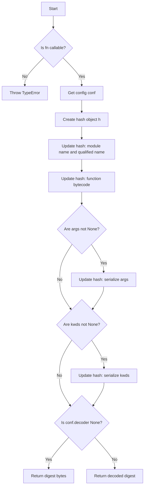

# Advanced Usage

## Custom Serializer

The result of the decorated function is serialized by default using [JSON][] (via the json module from the standard library) and then saved to [Redis][].

To utilize alternative serialization methods, such as [msgpack][], you have two options:

1. Specify the `serializer` argument in the constructor of [`RedisFuncCache`][], where the argument is a tuple of `(serializer, deserializer)`, or the name of the serializer function:

   This method applies globally: all functions decorated by this cache will use the specified serializer.

   For example:

   ```python
   import bson
   from redis import Redis
   from redis_func_cache import RedisFuncCache, lru_t_policy


   def serialize(x):
       return bson.encode({"return_value": x})


   def deserialize(x):
       return bson.decode(x)["return_value"]


   pool = Redis.ConnectionPool.from_url("redis://")
   cache = RedisFuncCache(
       __name__, lru_t_policy, factory=lambda: Redis.from_pool(pool), serializer=(serialize, deserialize)
   )


   @cache
   def func(): ...
   ```

1. Specify the `serializer` argument directly in the decorator. The argument should be a tuple of (`serializer`, `deserializer`) or simply the name of the serializer function.

   This method applies on a per-function basis: only the decorated function will use the specified serializer.

   For example:

   - We can use [msgpack][] as the serializer to cache functions whose return value is binary data, which is not possible with [JSON][].
   - We can use [bson][] as the serializer to cache functions whose return value is a `datetime` object, which cannot be handled by either [JSON][] or [msgpack][].

   ```python
   import msgpack
   from redis import Redis
   from redis_func_cache import RedisFuncCache, lru_t_policy

   pool = Redis.ConnectionPool.from_url("redis://")
   cache = RedisFuncCache(__name__, lru_t_policy, factory=lambda: Redis.from_pool(pool))


   @cache(serializer=(msgpack.packb, msgpack.unpackb))
   def create_or_get_token(user: str) -> bytes:
       from secrets import token_bytes

       return token_bytes(32)


   @cache(serializer="bson")
   def now_time():
       from datetime import datetime

       return datetime.now()
   ```

## Handler: Extending the Serialization Boundaries

When `serializer` is not enough — you need **async I/O**, **per-invocation context**, or the ability to **take over only one direction** while keeping the library's default on the other — pass a `handler` to the cache constructor. The four boundaries, the return conventions, the write/read path sequence diagrams, and a complete object-storage offload example are documented in [Handlers](handlers.md).

## Custom key format

An instance of [`RedisFuncCache`][] calculates key pair names through its policy's _keying_ component.
There are four built-in keying variants covering the two orthogonal naming choices:

- [`SingleKeying`][]: All functions share the same key pair, [Redis][] cluster is NOT supported.

  The format is: `<prefix><name>:<key>:<0|1>`

- [`MultipleKeying`][]: Each function has its own key pair, [Redis][] cluster is NOT supported.

  The format is: `<prefix><name>:<key>:<function_name>#<function_hash>:<0|1>`

- [`ClusterSingleKeying`][]: All functions share the same key pair, [Redis][] cluster is supported.

  The format is: `<prefix>{<name>:<key>}:<0|1>`

- [`ClusterMultipleKeying`][]: Each function has its own key pair, and [Redis][] cluster is supported.

  The format is: `<prefix><name>:<key>:<function_name>#{<function_hash>}:<0|1>`

Variables in the format string are defined as follows:

|                 |                                                       |
| --------------- | ----------------------------------------------------- |
| `prefix`        | `prefix` argument of [`RedisFuncCache`][]             |
| `name`          | `name` argument of [`RedisFuncCache`][]               |
| `key`           | `key` attribute of the keying component of the policy |
| `function_name` | full name of the decorated function                   |
| `function_hash` | hash value of the decorated function                  |

`0` and `1` at the end of the keys are used to distinguish between the two data structures:

- `0`: a sorted or unsorted set, used to store the hash value and sorting score of function invocations
- `1`: a hash table, used to store the return value of the function invocation

A policy is composed of three orthogonal components — keying, hasher and scripts:

```python
from redis_func_cache.hashing import PICKLE_MD5_HASHER
from redis_func_cache.keying import SingleKeying
from redis_func_cache.policies import Policy
from redis_func_cache.scripts import LruScripts

policy = Policy(SingleKeying("lru"), PICKLE_MD5_HASHER, LruScripts())
```

The built-in policies (e.g. `lru_policy`) are preset `Policy` instances using exactly this composition.
Policies are **stateless** — the key namespace (`prefix` / `name`) is passed to the policy's methods
at every call — so one instance can be shared by any number of caches; never copy or "bind" one.
If you want a different key format, subclass one of the keying classes, override `base_key`,
compose a `Policy`, and pass that instance to [`RedisFuncCache`][].
The following example demonstrates how to customize the key format for an _LRU_ policy:

```python
import redis
from redis import Redis
from redis_func_cache import RedisFuncCache
from redis_func_cache.hashing import PICKLE_MD5_HASHER
from redis_func_cache.keying import SingleKeying
from redis_func_cache.policies import Policy
from redis_func_cache.scripts import LruScripts

pool = redis.ConnectionPool.from_url("redis://")


def factory():
    return redis.Redis.from_pool(pool)

MY_PREFIX = "my_prefix"

class MyKeying(SingleKeying):
    def base_key(self, prefix: str, name: str, fn=None) -> str:
        return f"{prefix}-{name}-{fn.__name__}-{self.key}"

my_policy = Policy(MyKeying("my_key"), PICKLE_MD5_HASHER, LruScripts())
my_cache = RedisFuncCache("my_cache", my_policy, factory=factory, prefix=MY_PREFIX)

@my_cache
def my_func(*args, **kwargs): ...
```

In the example, we'll get a cache that generates [Redis][] keys separated by `-`, instead of `:`, prefixed by `"my-prefix"`, and suffixed by `"set"` and `"map"`, rather than `"0"` and `"1"`. The key pair names could be like `my_prefix-my_cache_func-my_key-set` and `my_prefix-my_cache_func-my_key-map`.

`LruScripts` tells the policy which Lua scripts to use, and `PICKLE_MD5_HASHER` tells the policy to use [`pickle`][] to serialize and `md5` to calculate the hash value of the function.

> ❗ **Important:**\
> The calculated key name **SHOULD** be unique for each [`RedisFuncCache`][] instance.
>
> The built-in keying classes build their key names in `base_key`, which uses their `key` attribute and the `name` property of the [`RedisFuncCache`][] instance.
> If you subclass any of these classes, you should pass a distinct `key` value to ensure that the key names remain unique.

## Custom Hash Algorithm

When the library performs a get or put action with [Redis][], the hash value of the function invocation will be used.

For the sorted set data structures, the hash value will be used as the member. For the hash map data structure, the hash value will be used as the hash field.

The algorithm used to calculate the hash value is defined in [`Hasher`][], and can be described as below:

```python
import hashlib


class Hasher:
    __hash_config__ = ...

    ...

    def calc_hash(self, fn=None, args=None, kwds=None):
        if not callable(fn):
            raise TypeError(f"Cannot calculate hash for {fn=}")
        conf = self.__hash_config__
        h = hashlib.new(conf.algorithm)
        h.update(f"{fn.__module__}:{fn.__qualname__}".encode())
        h.update(fn.__code__.co_code)
        if args is not None:
            h.update(conf.serializer(args))
        if kwds is not None:
            h.update(conf.serializer(kwds))
        if conf.decoder is None:
            return h.digest()
        return conf.decoder(h)
```

As the code snippet above shows, the hash value is calculated by the full name of the function, the bytecode of the function, and the arguments and keyword arguments — they are serialized and hashed, then decoded.

The serializer and decoder are defined in the `__hash_config__` attribute of the policy class and are used to serialize arguments and decode the resulting hash. By default, the serializer is [`pickle`][] and the decoder uses the md5 algorithm. If no decoder is specified, the hash value is returned as bytes.

This configuration can be illustrated as follows:


```mermaid
flowchart TD
    A[Start] --> B{Is fn callable?}
    B -->|No| C[Throw TypeError]
    B -->|Yes| D[Get config conf]
    D --> E[Create hash object h]
    E --> F[Update hash: module name and qualified name]
    F --> G[Update hash: function bytecode]
    G --> H{Are args not None?}
    H -->|Yes| I[Update hash: serialize args]
    H -->|No| J{Are kwds not None?}
    I --> J
    J -->|Yes| K[Update hash: serialize kwds]
    J -->|No| L{Is conf.decoder None?}
    K --> L
    L -->|Yes| M[Return digest bytes]
    L -->|No| N[Return decoded digest]
```

If we want to use a different algorithm, we can select a hasher class defined in `src/redis_func_cache/hashing.py` and compose it into a policy. For example:

- To serialize the function with [JSON][], use the SHA1 hash algorithm, store hex string in redis, you can choose the `JsonSha1HexHasher` class.
- To serialize the function with [`pickle`][], use the MD5 hash algorithm, store base64 string in redis, you can choose the `PickleMd5Base64Hasher` class.

These hasher classes provide alternative hash algorithms and serializers, allowing for flexible customization of the hashing behavior. The following example shows how to use the `JsonSha1HexHasher` class:

```python
from redis import Redis
from redis_func_cache import RedisFuncCache
from redis_func_cache.hashing import JsonSha1HexHasher
from redis_func_cache.keying import SingleKeying
from redis_func_cache.policies import Policy
from redis_func_cache.scripts import LruScripts


my_json_sha1_hex_policy = Policy(SingleKeying("my-lru"), JsonSha1HexHasher(), LruScripts())

pool = Redis.ConnectionPool.from_url("redis://")
my_json_sha1_hex_cache = RedisFuncCache("json_sha1_hex", my_json_sha1_hex_policy, factory=lambda: Redis.from_pool(pool))
```

If none of the predefined combinations fits — for example, you want `msgpack` serialization with `sha3_256` — subclass [`Hasher`][] with a custom [`HashConfig`][]:

```python
import msgpack
from redis_func_cache.hashing import HashConfig, Hasher

class MsgpackSha3Hasher(Hasher):
    __hash_config__ = HashConfig(algorithm="sha3_256", serializer=msgpack.packb)
```

Or even write an entire new algorithm. For that, we subclass `Hasher` and override the `calc_hash` method. For example:

```python
from __future__ import annotations

import hashlib
from typing import TYPE_CHECKING, override, Any, Callable, Mapping, Sequence
import cloudpickle
from redis import Redis
from redis_func_cache import RedisFuncCache
from redis_func_cache.hashing import Hasher
from redis_func_cache.keying import SingleKeying
from redis_func_cache.policies import Policy
from redis_func_cache.scripts import LruScripts

if TYPE_CHECKING:  # pragma: no cover
    from redis.typing import KeyT


class MyHasher(Hasher):
    @override
    def calc_hash(
        self, fn: Callable | None = None, args: Sequence | None = None, kwds: Mapping[str, Any] | None = None
    ) -> KeyT:
        assert callable(fn)
        dig = hashlib("balck2b")
        dig.update(fn.__qualname__.encode())
        dig.update(cloudpickle.dumps(args))
        dig.update(cloudpickle.dumps(kwds))
        return dig.hexdigest()


my_custom_hash_policy = Policy(SingleKeying("my-lru2"), MyHasher(), LruScripts())

my_custom_hash_cache = RedisFuncCache(__name__, my_custom_hash_policy, redis_client=redis_client)

redis_client = Redis.from_url("redis://")


@my_custom_hash_cache
def some_func(*args, **kwargs): ...
```

> 💡 **Tip:**\
> The purpose of the hash algorithm is to ensure the isolation of cached return values for different function invocations.
> Therefore, you can generate unique key names using any method, not just hashes.

[redis]: https://redis.io/ "Redis is an in-memory data store used by millions of developers as a cache"
[json]: https://www.json.org/ "JSON (JavaScript Object Notation) is a lightweight data-interchange format."
[`pickle`]: https://docs.python.org/library/pickle.html "The pickle module implements binary protocols for serializing and de-serializing a Python object structure."
[bson]: https://bsonspec.org/ "BSON, short for Bin­ary JSON, is a bin­ary-en­coded seri­al­iz­a­tion of JSON-like doc­u­ments."
[msgpack]: https://msgpack.org/ "MessagePack is an efficient binary serialization format."
[`RedisFuncCache`]: redis_func_cache.cache.RedisFuncCache
[`SingleKeying`]: redis_func_cache.keying.SingleKeying
[`MultipleKeying`]: redis_func_cache.keying.MultipleKeying
[`ClusterSingleKeying`]: redis_func_cache.keying.ClusterSingleKeying
[`ClusterMultipleKeying`]: redis_func_cache.keying.ClusterMultipleKeying
[`Hasher`]: redis_func_cache.hashing.Hasher
[`HashConfig`]: redis_func_cache.hashing.HashConfig
