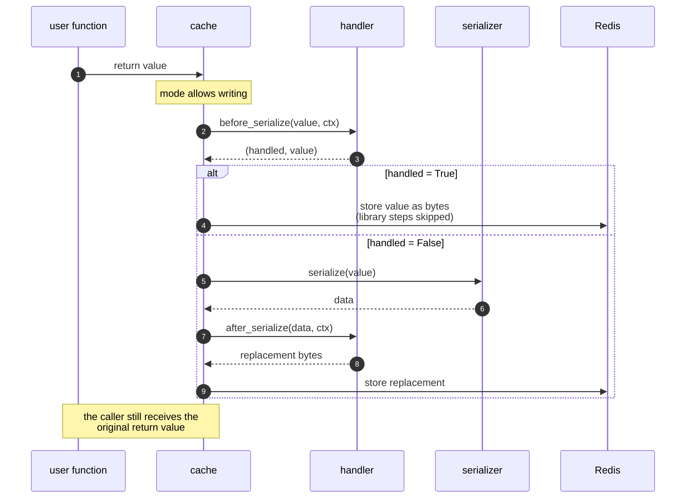
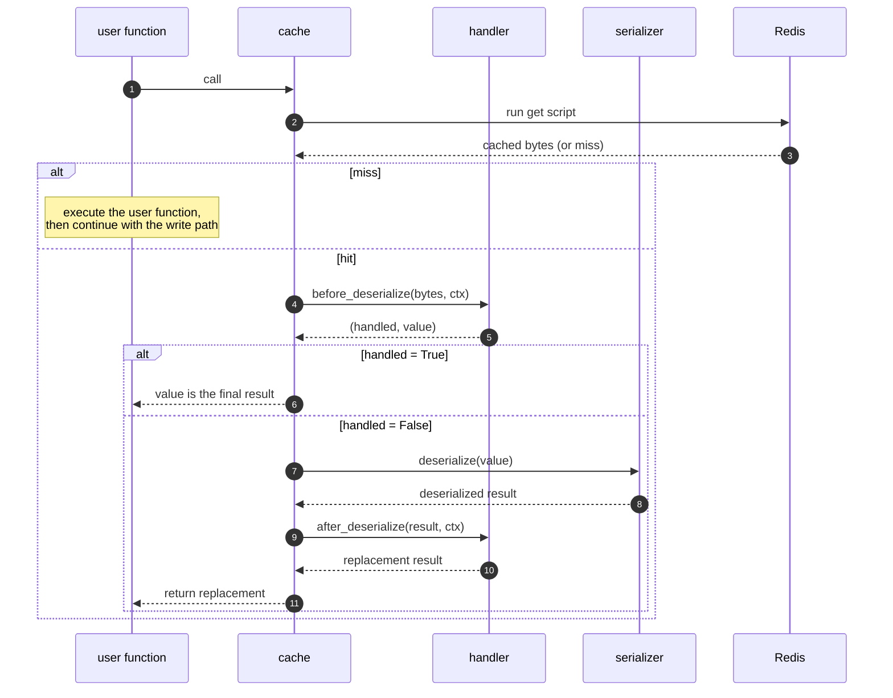

# Handlers: Extending the Serialization Boundaries

When `serializer` is not enough — you need **async I/O**, **per-invocation context**, or the ability to **take over only one direction** while keeping the library's default on the other — pass a `handler` to the cache constructor.

A handler is an active extension point, not a passive callback: when it reports that it has handled a boundary, the library skips **all** of its own remaining steps on that side, including the corresponding `after_*` method.

## When to Use a Handler vs a Serializer

|                                                            | `serializer=(ser, des)` | `handler=`                        |
| ---------------------------------------------------------- | ----------------------- | --------------------------------- |
| Encoding format only (JSON, msgpack, …)                    | ✅ preferred            | overkill                          |
| Sync custom encoding                                       | ✅ preferred            | overkill                          |
| Async I/O (object storage, remote fetch)                   | ❌ sync only            | ✅                                |
| Needs keys / args / func context                           | ❌ value only           | ✅                                |
| Take over one direction, keep library default on the other | ❌ both required        | ✅ per-boundary                   |
| Post-process deserialized value (enrichment, validation)   | possible inside `des`   | ✅ clearer at `after_deserialize` |
| Compress/encrypt library-produced bytes                    | ❌                      | ✅ at `after_serialize`           |

Rule of thumb: if you are only choosing an encoding, use the [serializer](advanced-usage.md#custom-serializer). If you need async I/O, call context, or taking over part of the library's own steps, use `handler`. The two may be combined: `serializer` defines the default encoding; `handler` may replace bytes at any boundary.

## The Four Boundaries

`HandlerProtocol` is a pure structural protocol — implementations need not inherit from it; matching its signatures is the contract, checked statically. The eight methods form two groups (sync and `*_async`): implement at least the group your execution path uses — both if you serve both — and keep the other group as `raise NotImplementedError` placeholders if unused. Within an implemented group every method is defined: boundaries you don't use return their input unchanged and unhandled — `before_*`: `(False, value)`, `after_*`: the value.

| Boundary                          | Sync                 | Async                      |
| --------------------------------- | -------------------- | -------------------------- |
| Write, before library serializes  | `before_serialize`   | `before_serialize_async`   |
| Write, after library serializes   | `after_serialize`    | `after_serialize_async`    |
| Read, before library deserializes | `before_deserialize` | `before_deserialize_async` |
| Read, after library deserializes  | `after_deserialize`  | `after_deserialize_async`  |

## Handler Context

Every handler method receives the value plus an immutable `HandlerContext` as a keyword-only argument:

```python
@dataclass(frozen=True)
class HandlerContext:
    keys: tuple[KeyT, KeyT]  # (zset_key, hash_key) for this cache entry
    hash_value: KeyT         # hash field for this invocation
    func: Callable | None    # the decorated function
    args: tuple              # effective positional arguments
    kwds: dict               # effective keyword arguments
```

`args` / `kwds` are the **effective** arguments — the same excludes-filtered arguments used to compute the cache keys — so references a handler builds from them stay consistent with cache identity.

## Return Conventions

- `before_serialize` / `before_deserialize` return `(handled, value)`. The `value` **always** replaces the working value; `handled` decides whether the library still runs its own serialize/deserialize step. When `handled=True`, the handler owns everything after that boundary: the library performs **no** further processing on that side, including the corresponding `after_*` method:
  - `before_serialize`, `handled=True`: skip the library serializer **and** `after_serialize` — `value` must already be bytes and is written to Redis as-is.
  - `before_deserialize`, `handled=True`: `value` is the final result — skip the library deserializer **and** `after_deserialize`.
- `after_serialize` / `after_deserialize` return the replacement value directly (not a tuple); there is no default library step left after them to skip.
- A boundary you don't use still returns explicitly and identically: `before_*` → `(False, value)` (unhandled, value unchanged — the library's default step runs), `after_*` → the value unchanged.

## The Write Path and the Read Path

### Write path

Runs only when the mode allows writing:

1. The user function executes and returns a value.
2. The library calls `before_serialize` with the return value.
3. The returned `value` replaces the value to store. If `handled` is `True`, the library skips everything else on this path and uses `value` as the stored bytes. Otherwise it serializes `value`, calls `after_serialize` with the bytes, replaces them with the return value, and writes the result to Redis.

The value returned to the caller is always the original return value of the user function. The handler affects what is stored, not what is returned.



### Read path

Runs only when the mode allows reading:

1. The library reads bytes from Redis.
2. No bytes → cache miss.
3. The library calls `before_deserialize` with the bytes.
4. The returned `value` replaces the working bytes. If `handled` is `True`, `value` is the final result: return it directly. If `handled` is `False`, deserialize `value`, call `after_deserialize` with the deserialized value, and return the replacement.



## Interaction with Cache Mode

- When reading is disabled, `before_deserialize` and `after_deserialize` are never called.
- When writing is disabled, `before_serialize` and `after_serialize` are never called.
- When both are disabled, no handler method is called.

This preserves the existing [write-only, read-only, and disabled mode semantics](configuration.md).

## Sync and Async Methods

Sync methods must not be coroutine functions; `*_async` methods must be. The asynchronous path calls **only** the `*_async` methods — there is **no** async-to-sync fallback — so an async cache requires the `*_async` group; a sync-only handler keeps that group as `raise NotImplementedError` placeholders. This guarantees that blocking synchronous I/O can never be introduced onto the event loop implicitly.

A handler may mix sync and async methods freely across boundaries.

## Registration

A handler may be set at cache level (constructor `handler=`) or per decorated function (`decorate(handler=...)`); the per-function value wins when given:

```python
cache = RedisFuncCache("name", lru_policy, factory=factory, handler=my_handler)  # instance-level

@cache.decorate(handler=offload_handler)  # per-function override
def big_payload_function(...): ...
```

With no handler at any level, behavior is identical to a cache without the handler system.

## Error Handling

Handlers are orthogonal to `ignore_redis_errors`, and handler errors are **entirely the application's responsibility**:

1. Redis errors from the library's own get/put are handled by the existing logic and are not routed through the handler.
2. Exceptions raised by a handler propagate to the caller. The library provides **no** retry, fallback, degradation, or error counting for handler failures. A handler that wants to degrade should catch its own exceptions and return `handled=False` (before-boundaries) or the original value (after-boundaries) to fall back to the library default.

The library also performs **no** runtime validation of handler behavior — no shape checks at registration, no return-value checks at invocation. The type annotations on `HandlerProtocol` are the contract; mypy (or any type checker) is the enforcement.

## Example: Offloading Large Values to Object Storage

The offload logic lives in the two `before_*` methods; the two `after_*` methods are identity functions, through which the library's own values pass unchanged:

```python
import redis
from redis_func_cache import lru_t_policy, RedisFuncCache
from redis_func_cache.handler import HandlerContext

LARGE = 1 << 20  # 1 MiB

class ObjectStorageOffload:
    """Store big payloads in object storage; Redis keeps only a reference."""

    def before_serialize(self, value, *, ctx: HandlerContext):
        payload = encode(value)  # your encoding, e.g. msgpack / HTML bytes
        if len(payload) <= LARGE:
            return False, value  # small: library serializes as usual
        ref = object_store.put(payload, ctx.args)  # async app: also define the *_async methods
        return True, encode_ref(ref)  # large: write only the reference bytes

    def before_deserialize(self, data, *, ctx: HandlerContext):
        if not is_ref(data):
            return False, data  # small: library deserializes as usual
        payload = object_store.get(decode_ref(data))
        return True, decode(payload)  # reference: resolve to the final value

    def after_serialize(self, data, *, ctx: HandlerContext):
        return data  # nothing to post-process: store the library's bytes as-is

    def after_deserialize(self, value, *, ctx: HandlerContext):
        return value  # nothing to post-process: return the library's value as-is

    # Asynchronous handlers are not implemented,
    # but below coroutines MUST be defined to fit the HandlerProtocol!

    async def before_serialize_async(self, value, *, ctx: HandlerContext):
        raise NotImplementedError("asynchronous handler not implemented")

    async def before_deserialize_async(self, data, *, ctx: HandlerContext):
        raise NotImplementedError("asynchronous handler not implemented")

    async def after_serialize_async(self, data, *, ctx: HandlerContext):
        raise NotImplementedError("asynchronous handler not implemented")

    async def after_deserialize_async(self, value, *, ctx: HandlerContext):
        raise NotImplementedError("asynchronous handler not implemented")

pool = redis.ConnectionPool.from_url("redis://")

cache = RedisFuncCache(
    __name__,
    lru_t_policy,
    factory=lambda: redis.Redis.from_pool(pool),
    handler=ObjectStorageOffload(),
)

# Or override per decorated function:
@cache.decorate(handler=OtherHandler())
def other_func(...): ...
```

The library never learns about object storage: it sees a small value on write and a final value on read.
